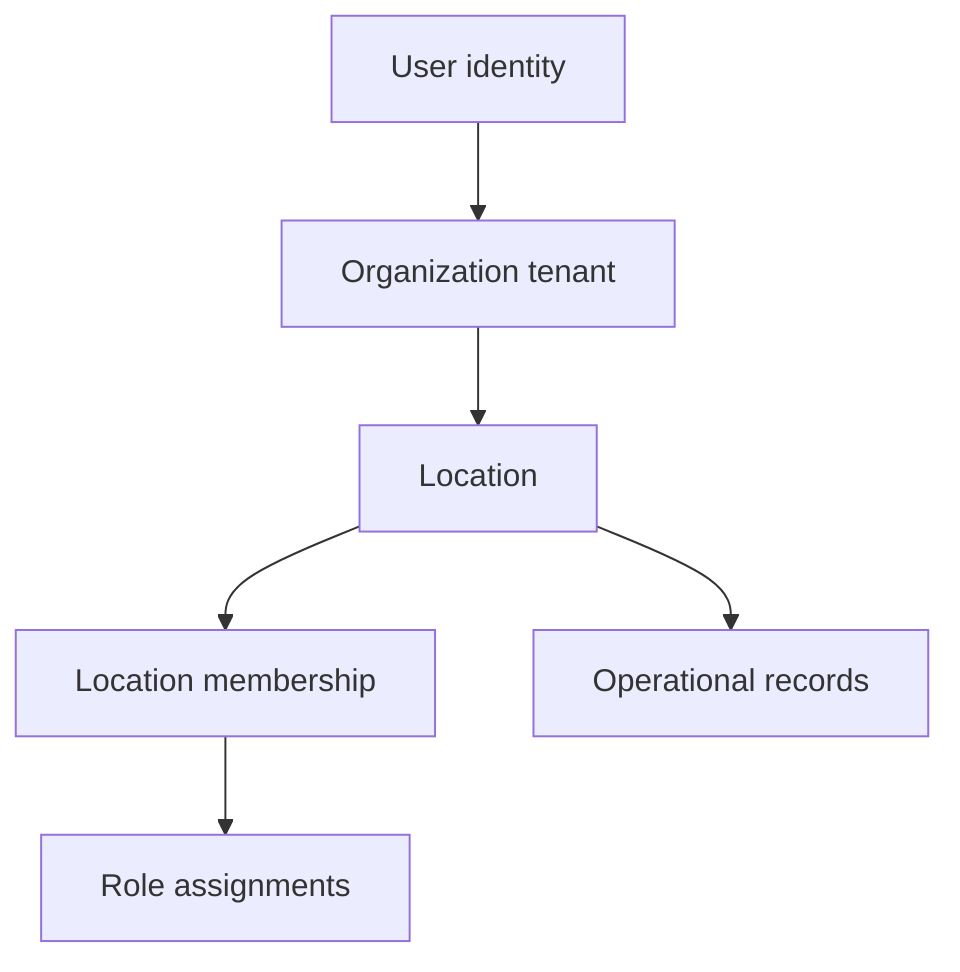

# Organization Management Platform — Product and Engineering Context

> **Document purpose:** This file is the persistent source of truth for humans and Codex while planning, designing, implementing, reviewing, or testing this project.
>
> **Last updated:** 2026-08-22  
> **Status:** Product blueprint; implementation has not yet been tied to a repository stack.  
> **Source:** Consolidated from the original Organization App architecture diagram and notes.

---

## 1. How Codex Must Use This File

Codex must read this file before making a product, database, API, authorization, UI, or workflow decision.

### 1.1 Mandatory working rules

1. Treat the multi-tenant hierarchy, isolation rules, permission rules, workflows, and business invariants in this file as authoritative.
2. Inspect the existing repository before choosing libraries, naming conventions, folder structure, or implementation patterns. Preserve established project conventions when they do not conflict with this document.
3. Do not invent missing business rules silently. Use the defaults in **Section 24** when a decision is still open, and clearly identify any assumption in the implementation summary.
4. Every tenant-owned query and mutation must enforce tenant and location scope on the server. Hiding UI controls is not authorization.
5. Every protected operation must be checked through permissions, not hard-coded role names, except for protected system-role invariants.
6. Keep database schema, migrations, API contracts, UI behavior, validation, audit logging, and automated tests consistent in the same change.
7. Store timestamps in UTC, preserve date-only business values as local dates, store each location's IANA timezone, and perform attendance/day-boundary calculations in the location timezone.
8. Store money in integer minor units, for example paise, together with an ISO currency code. Never use floating-point values for money.
9. Prefer reversible changes, additive migrations, idempotent commands, and backward-compatible API evolution.
10. Do not expose cross-tenant identifiers, personal data, attendance selfies, payment details, or internal error traces.
11. If a requested feature conflicts with this file, explain the conflict before implementing it.
12. When an approved product decision changes, update this file and add an entry to the decision log.

### 1.2 Requirement labels

- **REQUIRED:** Confirmed core behavior or essential engineering safeguard.
- **DEFAULT:** Recommended behavior to use until the owner decides otherwise.
- **OPEN:** A product decision that still needs confirmation.
- **FUTURE:** Deliberately outside the first production release.

---

## 2. Product Summary

The product is a multi-tenant organization management platform used by organization owners, organization staff, and organization members. A single user signs in once and can create a organization or request to join an existing organization. Each organization can have one or more locationes. Operational records are isolated by organization and, where applicable, by location.

The platform's core jobs are:

- Manage organizations, locationes, member profiles, roles, and permissions.
- Let authorized users and members clock in and out using configured evidence such as a punch action, selfie, and location.
- Manage shifts, leaves, holidays, announcements, and attendance history.
- Create membership plans and assign subscriptions.
- Track dues, payments, fines, receipts, and ad-hoc reminders in a reliable ledger.
- Show different navigation, data, and actions according to role, permission, tenant, and location context.

### 2.1 Product goals

- Give an owner complete control over one or more organization locationes.
- Make member onboarding and admission simple but owner-controlled.
- Make attendance verifiable and configurable per location or role.
- Make fees and subscription status immediately understandable.
- Support custom roles without code changes.
- Maintain strict tenant isolation and a complete audit trail.
- Keep the member experience simple and self-service.

### 2.2 MVP non-goals

The following are not part of the MVP unless the user explicitly adds them:

- Workout programming, exercise tracking, nutrition plans, or trainer marketplaces.
- Equipment maintenance and inventory.
- Biometric hardware integrations.
- Payroll and staff salary management.
- Public organization reviews or social feeds.
- Multiple currencies within the same organization.
- Full accounting, GST filing, or bank reconciliation.
- White-label mobile applications per organization.
- A separate super-admin business operations portal.

---

## 3. Terminology

| Term | Meaning |
| --- | --- |
| User | Global authenticated identity created through Google or another supported auth provider. |
| Organization | Top-level tenant/organization. A user may own or belong to more than one organization. |
| Location | Physical or operational location under a organization. Most operational data is location-scoped. |
| Member | A person with an accepted organization membership/profile. Staff and owners also have member profiles for consistent authorization and attendance. |
| Aspirant | Signed-in user who has requested to join a location but is not yet an accepted member. |
| Owner | Creator or transferred owner of a organization. Has protected full access within the owned organization. |
| Admin | Location/organization operator with a configurable set of permissions. |
| Organizationrat | Original product-facing name for a standard organization member. Use stable system role key `MEMBER`; the default display label may be `GYMRAT`. |
| Role | Named, location- or organization-scoped collection of permissions. |
| Permission | Atomic server-enforced capability such as `ATTENDANCE_READ_SELF`. |
| Plan | Reusable commercial offering: duration, price, benefits, and rules. |
| Subscription | A plan assigned to a member for a defined period and amount. |
| Charge | Money owed because of a subscription, fine, or manual adjustment. |
| Payment | Money received against one or more outstanding charges. |
| Ledger | Immutable financial entries that explain balances and payment history. |
| Attendance session | One clock-in/clock-out lifecycle, including evidence and derived status. |

Use `member`, not `customer` or misspelled variants, in new code and documentation.

---

## 4. Tenant and Ownership Model



### 4.1 Required hierarchy

- A `User` is global and must not be duplicated for each organization.
- A `Organization` is the primary tenant and owns locationes, roles, plans, branding, and organization-level settings.
- A `Location` belongs to exactly one organization.
- A `OrganizationMembership` represents a person's organization-specific profile and relationship to one organization. An invited/unclaimed profile may temporarily have no linked global user.
- A `LocationMembership` connects a organization membership to a location and contains location-specific status, role assignments, admission data, and membership number.
- The owner role assignment is organization-scoped. Staff/member roles are location-scoped by default.
- Each owner must also receive an active location membership in every location where attendance or location-member operations are needed. Creating a new location provisions these owner location memberships automatically.
- Operational records must contain `organization_id`; location-specific records must also contain `location_id`.
- A request-provided `organization_id`, `location_id`, or `member_id` is never trusted without checking the authenticated user's active membership and permissions.

### 4.2 Context selection

- After login, a user with access to one location enters it automatically.
- A user with access to multiple organizations or locationes must choose or switch active context.
- The current organization and location must be visible in the app shell.
- Switching context refreshes permissions, settings, cached data, and navigation.
- The server validates context on every request; a client header or route parameter is only a requested context, not proof of access.

### 4.3 Location scoping rule

Location is the operational reference for attendance, shifts, joins, admissions, subscriptions, payments, fines, reminders, and location announcements. Organization-level records such as organization identity, global roles, and shared plan templates may omit `location_id` only when explicitly designed to apply across all locationes.

### 4.4 Isolation invariant

No user from Organization A may read, infer, mutate, search, export, or receive notifications about Organization B unless the same user has an active membership in Organization B. This includes object storage paths, logs returned to clients, search suggestions, aggregates, and sequential identifiers.

---

## 5. Personas and Access States

### 5.1 Personas

1. **Owner**
   - Creates and manages the organization.
   - Creates locationes, roles, plans, administrators, and policies.
   - Has full organization access and cannot accidentally remove the last owner.

2. **Admin/Staff**
   - Operates locationes according to assigned permissions.
   - May approve members, manage attendance, subscriptions, dues, and announcements.
   - May also track personal attendance if the policy applies.

3. **Member / Organizationrat**
   - Requests to join a location.
   - Tracks personal attendance, fees, subscriptions, fines, and announcements.
   - Uses only the clock-in methods allowed by location and role policy.

### 5.2 User lifecycle states

| State | Meaning | Allowed destination |
| --- | --- | --- |
| `AUTHENTICATED_NO_CONTEXT` | Signed in, owns and belongs to no organization. | Discover/join a organization or create a organization. |
| `JOIN_PENDING` | Join request submitted and awaiting decision. | Pending screen, cancel request if policy allows. |
| `JOIN_REJECTED` | Request rejected. | View reason if shared; submit another request if permitted. |
| `ACTIVE_MEMBER` | Accepted and active in a location. | Permission-aware app. |
| `SUSPENDED_MEMBER` | Temporarily denied operational access. | Limited status/support screen; no attendance punch. |
| `INACTIVE_MEMBER` | Membership ended/deactivated. | Historical self-data according to retention policy; request reactivation. |

Account status and location membership status are different. Suspending one location membership must not disable the global user or the user's other organization memberships.

---

## 6. Scope by Module

### 6.1 Authentication and account

- Google sign-up/sign-in is required for the first release.
- Create exactly one global user per verified provider identity.
- Capture only required profile details from Google; collect missing phone/profile fields separately.
- Support logout, token refresh, revoked sessions, account deactivation, and provider-link conflict handling.
- Authentication identifies the user. Authorization is derived from active organization/location memberships and assigned roles.

### 6.2 Organization and location management

- Create and edit organization identity, contact details, branding, default timezone, and default currency.
- Create one or more locationes with address, map coordinates, contact data, timezone, status, and attendance settings.
- Never hard-delete a organization or location that has financial or attendance records. Archive it.
- A organization cannot become operational until its first location exists.
- Creating a organization must atomically create the owner organization membership, first location membership, and protected organization-scoped owner role assignment.
- Creating any later location must provision active location memberships for current owners without duplicating their organization profiles.

### 6.3 Members and admissions

- Search/discover organizations and locationes suitable for joining.
- Submit a join request to a specific location.
- Approve or reject a request with an audit trail.
- Create or complete a organization membership/profile, assign the default member role, generate a location-unique membership number, and optionally assign a subscription.
- Provide a member list with search, status filters, role filters, subscription filters, and pagination.
- Provide a member detail page with profile, location history, roles, attendance, subscriptions, dues, fines, notes, and audit-visible actions.
- Allow a properly authorized staff user to create an invitation or assisted admission for a person who has not installed the app.

### 6.4 Roles and permissions

- Create custom roles and attach atomic permissions.
- Assign one or more roles to a location membership.
- Compute effective permissions as the union of active assignments, subject to membership and location status.
- Seed protected system roles when the first location is created.
- Hide unavailable UI actions, but always repeat checks on the server.
- Record role/permission changes in the audit log.

### 6.5 Attendance

- Clock in and clock out using the location's allowed evidence requirements.
- Support punch confirmation, selfie, and location as independently configurable requirements.
- Display today, yesterday, this week, and this month views.
- Filter by attendance status and custom date range.
- Show a summary row/card and a detailed attendance record.
- Owners/admins see all records only with the correct permission; members see only their own records.
- Support corrections by authorized staff while retaining the original values and correction reason.

### 6.6 Shifts, leaves, and holidays

- Define shifts, expected start/end, grace periods, weekly patterns, and assignments.
- Define location holidays and optional organization-wide holidays.
- Submit, approve, reject, or cancel leave requests.
- Attendance classification must account for assigned shift, approved leave, and holiday calendars.

### 6.7 Plans, subscriptions, and fees

- Create reusable plans with name, duration, price, currency, description, tax/discount fields if enabled, and active status.
- Assign a plan as a member subscription with explicit dates and agreed price snapshot.
- Generate charges and ledger entries from subscriptions.
- Show subscriptions ordered by actionable priority: overdue, expired, expiring soon, active, upcoming, paused, cancelled.
- Receive full or partial payments and generate a unique receipt.
- Apply fines or manual adjustments with a reason and permission check.
- Create reminders for due/overdue items and preserve delivery history.

### 6.8 Announcements

- Authorized users create location- or organization-scoped announcements.
- Target all active members, selected roles, or selected members.
- Store a recipient snapshot so later role changes do not rewrite historical audience.
- Track publish time, expiry, author, delivery state, and read state where supported.

### 6.9 Audit and reporting

- Audit security-sensitive and business-sensitive mutations.
- Provide attendance totals, active members, upcoming expiries, overdue balance, and collection summaries.
- Reports must use the location timezone and permission-aware data scope.

---

## 7. Core Product Flows

### 7.1 First launch and authentication

1. User opens the app.
2. App shows onboarding and `Continue with Google`.
3. Successful provider authentication upserts the global `User` safely and idempotently.
4. Server returns the user's accessible organizations/locationes and membership states.
5. If there is no active membership, show the decision page:
   - `Join a organization`
   - `Create your organization`
6. If exactly one active location exists, open it.
7. If multiple contexts exist, show context selection and remember the last valid selection locally.

### Failure handling

- A cancelled Google flow returns to onboarding without creating a partial user.
- A duplicated/replayed callback must not duplicate the user.
- Disabled users see a safe account-status screen.
- Network failure shows retry; it must not falsely report success.

### 7.2 Owner creates a organization

1. Authenticated user chooses `Create your organization`.
2. User submits organization name, contact data, default timezone, default currency, and optional branding.
3. Server creates the organization in `DRAFT` state.
4. User creates the first location with address, timezone, location, and attendance defaults.
5. In one transaction, the system:
   - Activates the organization if all minimum fields are valid.
   - Creates protected system roles.
   - Creates the owner's organization membership/profile if one does not exist for that organization.
   - Creates the owner's active location membership.
   - Assigns the organization-scoped owner system role.
   - Records audit events.
6. Owner lands in the owner/admin interface for the new location.

If any operation in Step 5 fails, the system must roll back or leave a recoverable draft. It must never create an active organization without an owner.

### 7.3 Member requests to join

1. Authenticated aspirant chooses `Join a organization`.
2. App shows searchable organizations with public joining details; paginate results rather than hard-coding ten organizations.
3. User selects a organization and then one of its joinable locationes.
4. User reviews location details and submits required admission information.
5. Server creates one `PENDING` join request per user/location.
6. Owner/admin receives an in-app notification.
7. Aspirant sees a pending state and cannot use protected location features.

### 7.4 Owner/admin accepts a member

1. Authorized user opens pending join requests from the member area.
2. Staff reviews applicant data and chooses approve or reject.
3. On approval, a transaction:
   - Locks the pending request to prevent double processing.
   - Creates/reuses the organization membership/profile.
   - Creates an active location membership.
   - Assigns the configured default member role.
   - Generates the membership number.
   - Marks the request `APPROVED`.
   - Optionally creates a subscription and its opening charge.
   - Writes audit and notification events.
4. Member receives access immediately after permissions/context refresh.

### 7.5 Assisted admission / invitation

1. Authorized staff selects `New admission`.
2. Staff either selects an existing pending applicant or creates an invitation using verified contact information.
3. Staff assigns a plan/subscription if required.
4. The invited user signs in and claims the invitation using the verified identity/contact method.
5. Do not create a permanent duplicate global user merely because the person has not installed the app.

### 7.6 Attendance clock-in

1. Active member opens Attendance and taps `Clock in`.
2. Client loads the current effective attendance policy.
3. Client gathers required evidence: confirmation, live selfie, location, or their configured combination.
4. Server validates membership, permissions, location status, policy version, evidence freshness, geofence, and absence of an open session.
5. Server creates an attendance session with immutable clock-in evidence and returns the calculated status.
6. UI updates immediately from the server response.

### 7.7 Attendance clock-out

1. Member with an open session taps `Clock out`.
2. Client gathers clock-out evidence according to policy.
3. Server locks the open session, validates it, records clock-out, calculates duration and final status, and emits an event.
4. Repeated submission with the same idempotency key returns the original result.

### 7.8 Subscription assignment and payment

1. Authorized staff chooses a member and active plan.
2. Staff confirms start date, agreed price, discount, due date, and payment schedule.
3. Server snapshots plan terms into a subscription and creates ledger charges.
4. If money is collected, staff records or initiates payment.
5. Successful payment posts immutable ledger entries, allocates the amount to outstanding charges, updates the derived balance, and creates a receipt.
6. Failed or pending gateway attempts must not be counted as paid.

---

## 8. Information Architecture and UI Rules

Use one permission-aware application unless the repository explicitly chooses separate builds. Owner/admin and member experiences may share screens but must receive different data and actions.

### 8.1 Common screens

- Splash/session restore
- Onboarding and Google authentication
- Join-or-create decision
- Organization discovery and location selection
- Pending/rejected join status
- Active organization/location switcher
- Profile, account, notifications, and support
- Permission denied, suspended, offline, and error states

### 8.2 Owner/Admin interface

The confirmed MVP bottom navigation is:

1. **Attendance**
2. **Fees**
3. **Location**

Do not add more bottom-navigation destinations without a product decision. Secondary features live within these sections or a header/profile menu.

#### Attendance

- Today / Yesterday / This Week / This Month tabs.
- Status and date-range filters.
- Clock-in/out action when the current user is governed by an attendance policy.
- Announcement action in the top area for authorized roles.
- Summary metrics followed by attendance records.
- Compact record shows member, in/out times, status, duration, and evidence indicators.
- Tap opens detail with timeline, location, selfie access, device metadata, policy evaluation, edits, and audit history according to permission.

#### Fees

- Summary of collected amount, outstanding amount, and expiring memberships.
- Subscription list sorted by actionable priority.
- Filters for location, status, plan, date, and balance.
- Actions for assign subscription, record payment, add fine/adjustment, send reminder, and open receipt when permitted.

#### Location

- Location overview and settings.
- Menu items: Edit Location, Roles & Permissions, Members, Pricing/Plans, Shifts, Holidays, and Leaves, subject to permission.
- `Members` includes search, filters, join requests, member detail, and `New admission`.

### 8.3 Member interface

The confirmed MVP bottom navigation is:

1. **Attendance**
2. **Fees**

Profile and announcements may be accessible from the app bar or profile menu until navigation is finalized.

#### Attendance

- Clock-in/out using only configured methods.
- Today / Yesterday / This Week / This Month self-history.
- Status/date filters.
- Detail shows only the member's record and permitted evidence.
- Pending sync must be clearly distinct from confirmed server attendance.

#### Fees

- Current subscription, dates, remaining days, status, and balance.
- Subscription history, charges, payments, fines, reminders, and receipts.
- Payment action appears only when online payment is enabled.

### 8.4 Dynamic visibility

- Route visibility is based on effective permissions returned by the server.
- Buttons/actions must also check permission and record state.
- Direct navigation to a hidden route must still be denied by the API.
- A permission change must invalidate or refresh the user's authorization context promptly.

### 8.5 Required UI states

Every data surface must define loading, empty, error, offline/stale, forbidden, and success states. Destructive or financial mutations require confirmation. Never use color alone to communicate status.

---

## 9. Authorization Model

### 9.1 Permission naming

Use stable uppercase permission codes in the form:

`RESOURCE_ACTION_SCOPE`

Examples: `ATTENDANCE_READ_SELF`, `ATTENDANCE_READ_ALL`, `PAYMENT_CREATE`, `MEMBER_UPDATE`.

`ALL` is a reserved wildcard for the protected owner role. It must be resolved only by trusted server authorization code and must never be accepted from a normal role-create/update request.

### 9.2 Permission catalog

#### Organization and location

- `GYM_READ`
- `GYM_UPDATE`
- `GYM_ARCHIVE`
- `BRANCH_READ`
- `BRANCH_CREATE`
- `BRANCH_UPDATE`
- `BRANCH_ARCHIVE`
- `BRANCH_SETTINGS_UPDATE`

#### Roles

- `ROLE_READ`
- `ROLE_CREATE`
- `ROLE_UPDATE`
- `ROLE_DELETE`
- `ROLE_ASSIGN`

#### Members and admissions

- `MEMBER_READ_SELF`
- `MEMBER_READ_ALL`
- `MEMBER_CREATE`
- `MEMBER_UPDATE_SELF`
- `MEMBER_UPDATE_ALL`
- `MEMBER_SUSPEND`
- `MEMBER_DEACTIVATE`
- `JOIN_REQUEST_READ`
- `JOIN_REQUEST_APPROVE`
- `JOIN_REQUEST_REJECT`

#### Attendance and workforce

- `ATTENDANCE_READ_SELF`
- `ATTENDANCE_READ_ALL`
- `ATTENDANCE_CREATE_SELF`
- `ATTENDANCE_CREATE_ALL`
- `ATTENDANCE_UPDATE`
- `ATTENDANCE_DELETE`
- `ATTENDANCE_EXPORT`
- `SHIFT_READ_SELF`
- `SHIFT_READ_ALL`
- `SHIFT_MANAGE`
- `LEAVE_READ_SELF`
- `LEAVE_READ_ALL`
- `LEAVE_CREATE_SELF`
- `LEAVE_MANAGE`
- `HOLIDAY_READ`
- `HOLIDAY_MANAGE`

#### Fees

- `PLAN_READ`
- `PLAN_MANAGE`
- `SUBSCRIPTION_READ_SELF`
- `SUBSCRIPTION_READ_ALL`
- `SUBSCRIPTION_CREATE`
- `SUBSCRIPTION_UPDATE`
- `SUBSCRIPTION_CANCEL`
- `PAYMENT_READ_SELF`
- `PAYMENT_READ_ALL`
- `PAYMENT_CREATE`
- `PAYMENT_REFUND`
- `PAYMENT_VOID`
- `FINE_READ_SELF`
- `FINE_READ_ALL`
- `FINE_MANAGE`
- `REMINDER_READ_SELF`
- `REMINDER_READ_ALL`
- `REMINDER_MANAGE`

#### Communication, audit, and reporting

- `ANNOUNCEMENT_READ`
- `ANNOUNCEMENT_CREATE`
- `ANNOUNCEMENT_UPDATE`
- `ANNOUNCEMENT_DELETE`
- `REPORT_READ`
- `REPORT_EXPORT`
- `AUDIT_READ`

### 9.3 Seed roles

| System key | Default display name | Protected | Default access |
| --- | --- | --- | --- |
| `OWNER` | Owner | Yes | `ALL` within the organization; owner assignment protected. |
| `ADMIN` | Admin | Yes role key; permissions editable by owner | Operational management permissions, excluding ownership transfer and protected owner changes. |
| `MEMBER` | Organizationrat | Yes role key; display label may change | Read organization/location, self attendance, self fees, announcements, and self-service actions. |

Default `ADMIN` permissions should include ordinary location management, members, attendance, plans, subscriptions, payments, announcements, shifts, leaves, and reports. High-risk capabilities such as refund, void, role management, audit access, location archive, and organization update should be explicitly granted by the owner.

### 9.4 Role invariants

- System role keys cannot be deleted.
- The owner role cannot lose `ALL`.
- A organization must always have at least one active owner.
- Only an owner may transfer ownership or assign/remove the owner role.
- Removing one's own last administrative route must require warning and server-side validation.
- Custom role names are unique within their scope, case-insensitively.
- Role assignments are scoped to the organization membership or location membership, never stored directly on the global user.

### 9.5 Authorization evaluation

For every request:

1. Authenticate the global user.
2. Resolve requested organization and location.
3. Verify active user membership in that context.
4. Reject archived/suspended context as appropriate.
5. Load effective role assignments and permissions.
6. Verify required permission and self/all resource scope.
7. Verify ownership of the target resource by the same organization/location.
8. Apply record-state business rules.
9. Audit sensitive successful mutations and meaningful denials.

---

## 10. Attendance Domain

### 10.1 Attendance policy

An effective attendance policy may be defined at location level and optionally overridden for a role. It includes:

- `punch_required`: explicit user confirmation.
- `selfie_required_on_clock_in` and `selfie_required_on_clock_out`.
- `location_required_on_clock_in` and `location_required_on_clock_out`.
- `geofence_enabled`, center latitude/longitude, allowed radius in meters, and permitted accuracy threshold.
- `shift_enforcement_enabled`.
- early-arrival allowance, late grace, minimum session duration, and maximum open-session duration.
- whether admins may create manual records.
- whether offline capture is allowed.
- evidence retention policy.
- policy version and effective date.

The attendance session stores the policy version used when the action occurred.

### 10.2 Session fields

At minimum:

- IDs: session, organization, location, location membership.
- Clock-in: server time, client-captured time, timezone, coordinates/accuracy, selfie asset reference, device metadata, IP/risk metadata where legally appropriate.
- Clock-out: equivalent evidence fields.
- Assigned shift snapshot.
- Derived status, worked duration, late minutes, early-leave minutes.
- Source: self, admin, import, system auto-close.
- State: `OPEN`, `CLOSED`, `CORRECTED`, `VOID`.
- Correction metadata and audit reference.
- Idempotency keys for punch actions.

### 10.3 Business rules

- One open session per location membership unless multi-session mode is explicitly added.
- The server timestamp is authoritative; client time is retained only for diagnostics and offline policy.
- Location must be fresh and meet accuracy requirements. Never silently accept missing required evidence.
- Selfie evidence must be captured live in the attendance flow; gallery upload is disabled by default.
- Closing an already closed session returns a conflict or the prior idempotent result.
- Attendance correction never overwrites original evidence; it adds corrected values, reason, actor, and time.
- Overnight shifts are grouped by the shift's logical work date, not blindly by calendar midnight.
- Approved leave/holiday status and attendance presence must not create contradictory final labels without a defined precedence rule.

### 10.4 Suggested derived statuses

- `PRESENT`
- `LATE`
- `LEFT_EARLY`
- `HALF_DAY`
- `ABSENT`
- `ON_LEAVE`
- `HOLIDAY`
- `WEEK_OFF`
- `INCOMPLETE`
- `MANUAL`
- `VOID`

Status is derived where possible; manual override requires reason and permission.

### 10.5 Attendance ordering and filters

- Today/yesterday are calculated in location timezone.
- Week start is configurable; default Monday.
- Custom ranges are inclusive of local start/end days, converted safely to UTC.
- Lists support status, member, role, shift, evidence issue, and date filters for authorized staff.

---

## 11. Leave, Holiday, and Shift Rules

### 11.1 Shift

- A shift has a name, local start/end times, break policy, weekly recurrence, grace settings, and active range.
- Assignments may target a member or role but must resolve to a member-level effective assignment.
- Changing a shift does not rewrite historical attendance; attendance stores a snapshot.

### 11.2 Leave

State flow:

`PENDING → APPROVED | REJECTED | CANCELLED`

- A member creates leave only for self unless holding administrative permission.
- Approvers cannot approve an overlapping duplicate without resolving the conflict.
- Approval/rejection records actor, time, and optional note.
- Cancelling approved leave after related attendance exists requires an explicit resolution.

### 11.3 Holidays

- Holiday has local date, name, location/organization scope, and optional recurrence metadata.
- Location-specific exceptions override organization-wide calendars.

---

## 12. Plans, Subscriptions, Fees, and Ledger

### 12.1 Plan

A plan is a reusable template and should contain:

- Name, description, organization, and optional location availability.
- Duration type/value or explicit period rules.
- Base amount in minor units and currency.
- Optional joining fee, tax, discount rules, and grace days.
- Active/inactive state.
- Benefits/limits as structured metadata only when used by a feature.

Editing a plan must not mutate historical subscription prices or terms.

### 12.2 Subscription

- Belongs to one location membership.
- Stores selected plan ID plus a snapshot of commercial terms.
- Contains start date, end date, billing/due dates, amount, discount, status, and creator.
- Supports renewal as a new subscription or linked renewal record; do not erase history.
- Overlap is denied by default unless an upcoming renewal begins after the current end date.

Suggested states:

- `DRAFT`
- `UPCOMING`
- `ACTIVE`
- `PAUSED`
- `EXPIRED`
- `CANCELLED`

`OVERDUE` is primarily a financial condition derived from unpaid due charges; it may be displayed alongside subscription state rather than corrupting the lifecycle state.

### 12.3 Financial ledger

Use append-only ledger entries. A cached balance may exist for performance but must be reproducible from entries.

Entry categories include:

- Subscription charge
- Joining fee
- Fine
- Discount/credit
- Payment
- Refund
- Void/reversal
- Manual debit/credit adjustment

Required rules:

- Never edit a posted financial entry. Reverse it with a linked compensating entry.
- Record actor, reason, location, member, currency, source entity, and timestamps.
- Receipt numbers are unique per organization or location according to the selected numbering policy.
- Payment amount must be positive and cannot be allocated beyond valid rules.
- Partial payment is supported.
- A payment gateway webhook is authoritative for asynchronous online payment completion and must be signature-verified and idempotent.
- Refund/void requires special permission and audit logging.

### 12.4 Fee priority in UI

Default sorting priority:

1. Outstanding overdue charges
2. Expired subscription with unpaid balance
3. Subscription expiring within configured threshold
4. Active subscription
5. Upcoming subscription
6. Paused subscription
7. Cancelled/history

### 12.5 Fines and reminders

- A fine creates a ledger charge with category, amount, reason, actor, and optional due date.
- A reminder never changes the financial balance.
- Reminder supports a scheduled date, message, channel, status, recipient, linked charge/subscription, and delivery attempts.
- Ad-hoc reminders may target operational tasks as well as fees, but their type must be explicit.

---

## 13. Announcement Rules

- Announcement status: `DRAFT`, `SCHEDULED`, `PUBLISHED`, `EXPIRED`, `CANCELLED`.
- Audience: all active location members, selected roles, or selected memberships.
- Content includes title, body, priority, optional attachment, publish time, and expiry time.
- Only authorized users can create/update/delete.
- Published content changes should preserve revision history for audit-sensitive use.
- Do not send an announcement to suspended/inactive members unless the sender explicitly selects an allowed administrative audience.
- Push delivery failure must not delete the in-app announcement.

---

## 14. Domain Data Model

This is a logical model. Adapt table/collection naming to repository conventions without changing ownership or invariants.

| Entity | Purpose | Required ownership/scope |
| --- | --- | --- |
| `User` | Global identity and base profile. | Global. |
| `AuthIdentity` | Google/provider subject linked to user. | Global; unique provider + subject. |
| `Organization` | Tenant organization. | Self/tenant root. |
| `Location` | Organization location/operating unit. | `organization_id`. |
| `OrganizationMembership` | Organization-specific person profile/relationship. | `organization_id`, `user_id` optional for invited/unclaimed profile. |
| `LocationMembership` | Person's relationship to a location. | `organization_id`, `location_id`, `organization_membership_id`. |
| `JoinRequest` | Aspirant request or invitation workflow. | `organization_id`, `location_id`, `user_id`. |
| `Role` | Named permission bundle. | `organization_id`; optional `location_id` if location-local. |
| `Permission` | Canonical permission catalog. | Global/system. |
| `RolePermission` | Role-to-permission mapping. | Role scope. |
| `RoleAssignment` | Organization- or location-membership-to-role mapping. | `organization_id`; optional `location_id`; exactly one compatible membership target. |
| `AttendancePolicy` | Effective evidence and timing rules. | `organization_id`, `location_id`; optional role override. |
| `AttendanceSession` | Clock-in/out record. | `organization_id`, `location_id`, `location_membership_id`. |
| `AttendanceEvidence` | Selfie/location/device evidence. | Same as attendance session; private asset reference. |
| `Shift` | Reusable work/attendance schedule. | `organization_id`, `location_id`. |
| `ShiftAssignment` | Effective member schedule. | `location_membership_id`. |
| `LeaveRequest` | Leave lifecycle. | `organization_id`, `location_id`, `location_membership_id`. |
| `Holiday` | Organization/location calendar exception. | `organization_id`, optional `location_id`. |
| `Plan` | Commercial plan template. | `organization_id`, optional location availability. |
| `Subscription` | Assigned plan snapshot. | `organization_id`, `location_id`, `location_membership_id`. |
| `LedgerEntry` | Immutable debit/credit record. | `organization_id`, `location_id`, `location_membership_id`. |
| `PaymentAttempt` | Cash/manual/gateway payment lifecycle. | Same financial scope. |
| `PaymentAllocation` | Maps payments/credits to charges. | Same financial scope. |
| `Receipt` | Human-readable payment acknowledgment. | Same financial scope. |
| `Reminder` | Scheduled/ad-hoc notification task. | `organization_id`, `location_id`; linked target. |
| `Announcement` | Audience-targeted message. | `organization_id`, optional `location_id`. |
| `AnnouncementRecipient` | Published audience/read snapshot. | Same announcement scope. |
| `MediaAsset` | Private selfie/logo/attachment metadata. | Owner entity plus organization scope. |
| `Notification` | In-app/push delivery state. | Recipient user and tenant scope. |
| `AuditLog` | Append-only mutation/security trail. | `organization_id`, optional `location_id`. |

### 14.1 Common fields

Tenant-owned mutable entities generally include:

- Stable UUID/ULID primary key.
- `organization_id` and optional/required `location_id` according to scope.
- `created_at`, `updated_at`, `created_by`, `updated_by`.
- `version` for optimistic concurrency where concurrent edits matter.
- `archived_at`/`archived_by` for recoverable deactivation when applicable.

### 14.2 Important constraints

- Unique auth identity by provider and provider subject.
- Unique active join request per `user_id + location_id`.
- Unique claimed organization membership per `user_id + organization_id`.
- Unique location membership per `organization_membership_id + location_id`.
- Unique membership number per location.
- Unique protected system role key per role scope.
- At most one open attendance session per location membership.
- Subscription dates and amounts must be valid.
- Ledger entry currency must match organization currency in the MVP.
- Idempotency key unique within actor/operation scope.

### 14.3 Deletion policy

- Use hard deletion only for unreferenced drafts or legally required privacy workflows.
- Archive organizations, locationes, members, plans, roles, and subscriptions where history exists.
- Financial ledger and audit records are append-only and never hard-deleted through normal product operations.
- Media retention/deletion must be configurable and comply with consent/privacy requirements.

---

## 15. API Contract Guidelines

Use the repository's existing API style. If none exists, use versioned REST under `/api/v1` with JSON, consistent pagination, typed error codes, and idempotency support.

### 15.1 Suggested resource groups

- `/auth/google`, `/auth/refresh`, `/auth/logout`, `/me`
- `/organizations`, `/organizations/{organizationId}`
- `/organizations/{organizationId}/locationes`
- `/locationes/{locationId}/members`
- `/locationes/{locationId}/join-requests`
- `/locationes/{locationId}/roles`
- `/locationes/{locationId}/attendance-policy`
- `/locationes/{locationId}/attendance-sessions`
- `/locationes/{locationId}/shifts`
- `/locationes/{locationId}/leave-requests`
- `/locationes/{locationId}/holidays`
- `/locationes/{locationId}/plans`
- `/locationes/{locationId}/subscriptions`
- `/locationes/{locationId}/ledger`
- `/locationes/{locationId}/payments`
- `/locationes/{locationId}/reminders`
- `/locationes/{locationId}/announcements`
- `/locationes/{locationId}/reports`
- `/locationes/{locationId}/audit-logs`

### 15.2 Command-style actions

State transitions should use explicit command endpoints or clearly named service methods, for example:

- `POST /join-requests/{id}/approve`
- `POST /join-requests/{id}/reject`
- `POST /attendance-sessions/clock-in`
- `POST /attendance-sessions/{id}/clock-out`
- `POST /attendance-sessions/{id}/correct`
- `POST /subscriptions/{id}/pause`
- `POST /subscriptions/{id}/cancel`
- `POST /payments/{id}/refund`
- `POST /leave-requests/{id}/approve`
- `POST /announcements/{id}/publish`

Do not accept arbitrary state values through a generic update endpoint when a transition has business rules.

### 15.3 Response behavior

- Use cursor pagination for large or fast-changing lists where practical.
- Return machine-readable error `code`, safe human `message`, optional field errors, and a request/correlation ID.
- Never return stack traces or raw database errors.
- Return `409 Conflict` for duplicate open attendance, stale transitions, duplicate join requests, or optimistic-lock failures.
- Return `403 Forbidden` for insufficient permission and `404` when hiding the existence of another tenant's resource is safer.
- Support an idempotency key on attendance punches, admissions, subscription creation, and payment posting.

### 15.4 Search and filters

- Search endpoints must remain tenant-scoped.
- Normalize and escape search input.
- Bound page size and date ranges.
- Use stable secondary sorting by ID to prevent duplicate/missing records between pages.

---

## 16. Security, Privacy, and Audit

### 16.1 Authentication/session security

- Verify Google tokens on the server using issuer, audience, expiry, and nonce/state rules appropriate to the client.
- Use short-lived access tokens and securely rotated refresh sessions, or the repository's equivalent secure session model.
- Store mobile secrets in platform secure storage, not plain preferences.
- Revoke sessions after account disablement or high-risk credential changes.
- Rate-limit auth, join, attendance, payment, and invitation endpoints.

### 16.2 Tenant security

- Apply tenant filters in a shared repository/service layer so endpoints cannot forget them.
- Include tenant context in cache keys, object-storage paths, jobs, events, and logs.
- Never authorize from client-supplied role/permission arrays.
- Add automated cross-tenant isolation tests for every module.

### 16.3 Personal data

- Attendance selfies and precise locations are sensitive and private.
- Obtain clear consent and explain purpose before first capture.
- Use private object storage and short-lived signed access.
- Strip unnecessary image metadata.
- Restrict selfie/location access with specific permissions and audit access where feasible.
- Define retention and deletion periods before production launch.
- Do not put secrets, tokens, full payment data, or raw image data in logs.

### 16.4 Audit log

Audit at least:

- Organization/location creation, update, archive.
- Role, permission, and assignment changes.
- Join approvals/rejections and member status changes.
- Attendance corrections, manual entries, voids, and policy changes.
- Plan/subscription changes.
- Payment, refund, void, fine, and adjustment operations.
- Announcement publication/deletion.
- Export of member, attendance, financial, or audit data.

Audit record includes actor, tenant, location, action, target type/ID, timestamp, request ID, safe before/after diff, source, and reason when required.

---

## 17. Notifications and Background Jobs

### 17.1 Event-driven notifications

Create notifications for:

- Join request submitted, approved, or rejected.
- Invitation created or expiring.
- Announcement published.
- Subscription assigned, activated, expiring, expired, paused, or cancelled.
- Charge due, overdue, payment received, payment failed, and receipt generated.
- Leave submitted, approved, or rejected.
- Attendance anomaly or auto-close, if enabled.

### 17.2 Job requirements

- Jobs must be idempotent and tenant-aware.
- Persist job state or use an outbox so database success is not lost when notification delivery fails.
- Retry transient failures with bounded exponential backoff.
- Move permanently failing work to a dead-letter/review state.
- Scheduled jobs calculate local dates in location timezone.
- Do not send duplicates for the same event/channel/recipient.

---

## 18. Offline, Sync, and Media Behavior

- Read-only cached data may be displayed with a visible stale/offline label.
- Financial posting, role changes, join approval, and attendance correction require server confirmation.
- **DEFAULT:** attendance punch requires connectivity. If offline attendance is later enabled, store tamper-evident client capture time, policy version, evidence, device ID, and sync status; the server may reject or flag it.
- Never display an offline attendance action as confirmed before server acceptance.
- Compress selfies while retaining enough quality for verification.
- Upload media through authorized short-lived upload instructions or the repository's secure media service.
- Clean orphaned media through a safe background job.

---

## 19. Validation and Edge Cases

Every implementation must handle at least these cases:

- User owns a organization and also belongs to another organization.
- User belongs to multiple locationes with different roles.
- Location is archived while a user is active in it.
- Admin's permissions are revoked during an active session.
- Two admins approve the same join request simultaneously.
- Duplicate invitation and join request for the same person.
- Member attempts to punch twice or clock out twice.
- App retries after a timeout even though the first request succeeded.
- GPS permission denied, stale coordinates, mock/suspicious location, or poor accuracy.
- Camera denied or upload fails after capture.
- Overnight shift crosses date boundary or daylight-saving change.
- Holiday and approved leave overlap.
- Subscription is renewed early, paused, cancelled, or created with a future start.
- Partial payment, overpayment, failed gateway callback, duplicate webhook, refund, or reversal.
- Owner tries to delete the final owner role assignment.
- Custom role is edited while assigned users are online.
- Same email/phone appears in an unclaimed invited profile and later authenticated user.
- Tenant ID or resource ID from another organization is supplied directly to an endpoint.

---

## 20. Reporting and Dashboard Metrics

MVP reports should include:

### Attendance

- Present/late/absent/on-leave counts for selected local day.
- Currently clocked-in members.
- Average session duration.
- Missing clock-outs and evidence failures.

### Members

- Active, pending, suspended, and inactive counts.
- New admissions and churn/deactivations by period.
- Members by plan and role.

### Fees

- Collected, outstanding, overdue, refunded, and adjusted amounts.
- Subscriptions expiring in configured windows.
- Collection by payment method and plan.

All dashboards must disclose the selected organization, location, date range, timezone, and last refresh time.

---

## 21. Non-Functional Requirements

### Reliability

- Transactions protect admission, role seeding, attendance transitions, and ledger posting.
- Financial and attendance commands are idempotent.
- Background delivery uses an outbox or equivalent reliable event mechanism.
- Backups and restore drills are defined before production.

### Performance

- Paginate member, attendance, subscription, ledger, audit, and notification lists.
- Add composite indexes beginning with tenant/location scope and matching real query filters.
- Avoid loading full role, history, or evidence graphs in list endpoints.
- Use object storage, not database blobs, for selfies and attachments.

### Observability

- Structured logs with request ID, safe user ID, organization/location ID, action, duration, and result.
- Metrics for request errors/latency, auth failures, punch failures, job backlog, webhook failures, and payment posting.
- Traces for multi-step admissions and payments when infrastructure supports them.
- Alerts must avoid leaking personal data.

### Accessibility and usability

- Support screen readers, scalable text, keyboard navigation on web, and adequate contrast.
- Confirm high-risk actions and provide actionable errors.
- Use local date/time presentation and consistent currency formatting.

### Localization

- Keep user-facing strings externalized from the beginning.
- **DEFAULT:** English first; Hindi-ready architecture.
- Do not store translated display text as domain status values.

---

## 22. Recommended Technical Baseline

This section is a default only when no implementation stack exists. If the repository already contains a coherent stack, keep it and map these requirements onto it.

### 22.1 Suggested stack

- Mobile client: Flutter with a feature-first structure and repository/state-management pattern already preferred by the project.
- API: Node.js + TypeScript with a structured service/controller/repository architecture.
- Primary database: PostgreSQL for relational constraints, transactions, reporting, and immutable financial records.
- Cache/jobs: Redis-backed queue only where required; do not add it before there is a concrete use.
- Media: S3-compatible private object storage.
- Push notifications: Firebase Cloud Messaging.
- Authentication: Google identity verified by the backend; backend owns application sessions.
- API documentation: OpenAPI generated or validated from the same contracts used by the server.

### 22.2 Architectural boundaries

Start as a modular monolith. Keep modules separated in code and data ownership, but do not introduce microservices until scaling or team boundaries justify them.

Suggested backend modules:

- auth
- users
- organizations
- locationes
- memberships
- authorization
- attendance
- workforce
- plans
- subscriptions
- ledger/payments
- reminders
- announcements
- notifications
- reporting
- audit
- media

### 22.3 Suggested repository shape when starting from empty

```text
apps/
  mobile/
  api/
docs/
  decisions/
  api/
infra/
CONTEXT.md
README.md
```

Adapt this to the selected framework. Do not reorganize a working repository solely to match this example.

---

## 23. Engineering Standards for Codex

### 23.1 General

- Prefer clear domain names over abbreviations.
- Keep controllers thin; business rules belong in services/domain code.
- Centralize tenant scoping and permission checks.
- Validate all external input at the boundary.
- Use database transactions for multi-entity invariants.
- Use explicit enums/state machines for lifecycle transitions.
- Avoid hidden side effects in model hooks for core financial/security behavior.
- Add comments for why a non-obvious rule exists, not for what obvious code does.

### 23.2 Database changes

- Create forward migrations; do not edit previously applied migrations.
- Backfill safely and in batches for large tables.
- Add constraints after data is compatible.
- Add indexes that match scoped production queries.
- Include rollback/recovery notes for risky migrations.

### 23.3 Testing expectations

Each feature should include:

- Unit tests for calculations, policies, state transitions, and permission evaluation.
- Integration tests for database constraints and transactions.
- API tests for success, validation, forbidden access, cross-tenant isolation, duplicate/retry behavior, and state conflicts.
- UI/widget tests for permission-aware visibility and critical states.
- End-to-end tests for owner onboarding, member joining, attendance, and payment lifecycle.

Never mark a feature done using only happy-path tests.

### 23.4 Change summary format

After implementation, Codex should report:

1. Outcome delivered.
2. Important product/technical decisions or assumptions.
3. Files/modules changed.
4. Migration/configuration steps.
5. Tests and verification run.
6. Remaining open issue or risk, if any.

---

## 24. Open Decisions and Safe Defaults

Use the default only until an explicit decision is made. Move resolved items to the decision log.

| Open decision | Safe default |
| --- | --- |
| Final product/brand name | Use `Organization Management Platform` in technical copy; make UI branding configurable. |
| Is `GYMRAT` the permanent member-facing term? | Use system key `MEMBER`; default display label `Organizationrat`, configurable later. |
| Can a user belong to multiple organizations/locationes? | Yes; support a context switcher. |
| Role scope | Organization-defined roles reusable across locationes, with location-scoped assignments. Add location-local roles only if required. |
| Owner scope | Organization-wide owner access to every location. |
| Default member approval | Manual approval by authorized owner/admin. |
| Assisted admissions before app signup | Create an unclaimed organization membership/profile invitation; link after verified sign-in. |
| Public organization discovery details | Show name, location, general address, contact/join status, and logo; never expose member data. |
| Attendance methods | Location config can require punch + selfie + location independently. |
| Offline attendance | Disabled for MVP. |
| Face recognition | Not in MVP; selfie is evidence only. |
| Location validation | Geofence configurable; record accuracy and reject evidence outside configured limits when enforced. |
| Attendance correction | Admin with permission; immutable original plus reason/audit. |
| Auto clock-out | Disabled initially; flag open sessions for review. |
| Week start | Monday, configurable per organization. |
| Currency | INR (`INR`) and amounts in paise for first release. |
| Pricing page meaning | Plan catalog plus location pricing settings. |
| Taxes/GST | Store optional tax metadata but do not claim tax compliance until requirements are defined. |
| Online payment gateway | Keep provider abstraction; manual/cash payment first unless a gateway is selected. |
| Partial payments | Supported. |
| Overpayments | Reject by default unless explicit account-credit behavior is approved. |
| Subscription overlap | Only allow a non-overlapping upcoming renewal. |
| Expiring-soon threshold | 7 days, configurable. |
| Notification channels | In-app + push first; SMS/WhatsApp/email are future integrations. |
| Selfie/location retention | Must be decided with legal/privacy review before production; use configurable retention. |
| Admin UI form factor | Same permission-aware mobile app for MVP; web admin is future scope. |
| Data export | CSV for authorized reports after audit/export safeguards exist. |

---

## 25. Delivery Roadmap

### Phase 0 — Product and technical foundation

- Confirm open decisions needed for MVP.
- Initialize repository, environments, CI, code quality, migrations, secrets strategy, and observability baseline.
- Define UI design tokens and common loading/error/empty states.
- Create threat model and tenant isolation test strategy.

**Exit criteria:** app/API boot in development and CI; database migration works; health checks, structured errors, and secure configuration are established.

### Phase 1 — Authentication and tenant onboarding

- Google authentication and application sessions.
- Global user profile.
- Join-or-create decision.
- Organization creation, first location creation, owner organization/location memberships, seeded roles.
- Context selection/switching.

**Exit criteria:** a new owner can create a usable organization safely; a returning user enters the correct location; transaction rollback and cross-tenant tests pass.

### Phase 2 — Members and RBAC

- Permission catalog and policy enforcement.
- Role management and assignment.
- Organization/location discovery.
- Join requests, approval/rejection, invitations, assisted admissions.
- Member list and detail.

**Exit criteria:** owner/admin/member see and can do only permitted actions; approval is concurrency-safe; no cross-tenant access is possible.

### Phase 3 — Attendance

- Attendance policy, location/selfie evidence, clock-in/out.
- Self and staff attendance views, tabs, filters, details.
- Correction/audit workflow.
- Shifts, holidays, and leave if needed for attendance classification.

**Exit criteria:** duplicate punches are prevented; evidence requirements are enforced; overnight/timezone cases and permission tests pass.

### Phase 4 — Plans, subscriptions, and fees

- Plans and pricing.
- Subscription assignment/renewal.
- Ledger, charges, partial/manual payments, receipts, fines.
- Fee priority views and member self-history.
- Reminders.

**Exit criteria:** every displayed balance is reconstructable from immutable entries; duplicate posting is prevented; financial permission and audit tests pass.

### Phase 5 — Communications and operations

- Announcements and recipient targeting.
- Push/in-app notification delivery.
- Reporting dashboards and exports.
- Background job hardening.

**Exit criteria:** recipient scope is correct, jobs are idempotent, reports match source records, and exports are permission/audit protected.

### Phase 6 — Production hardening

- Performance/load testing.
- Security and privacy review.
- Backup/restore test.
- Monitoring and alerting.
- Accessibility and device testing.
- App store/release procedures and incident runbook.

**Exit criteria:** defined SLOs, recovery procedure, retention rules, support path, and release checklist are approved.

---

## 26. MVP Acceptance Criteria

### Authentication and onboarding

- A new user can sign in with Google exactly once without duplicate identities.
- A user can choose to create a organization or join one.
- Organization creation produces a first location, owner profile, owner assignment, and seed roles atomically.
- A multi-context user can switch organization/location without leaking the previous context's data.

### Membership and RBAC

- A user can search a organization, choose a location, and submit one pending request.
- Authorized staff can approve or reject; concurrent repeat processing is safe.
- Approval creates an active membership with the configured default role.
- Custom roles change effective UI and API access.
- Owner protection and last-owner rules cannot be bypassed.

### Attendance

- A member can clock in/out only when active and authorized.
- Required selfie/location evidence is validated.
- Duplicate/open-session conflicts are safe and idempotent retries do not duplicate records.
- Self users cannot read another member's attendance.
- Authorized corrections preserve original data and audit reason.
- Today/yesterday/week/month reflect location timezone.

### Fees

- Staff can create a plan and assign a subscription.
- The assignment snapshots price and creates correct charges.
- Partial payments update allocations and balances correctly.
- A retry or duplicate webhook cannot double-post money.
- Member sees only personal subscription, fee, fine, payment, and receipt history.
- Overdue/expired/expiring sorting follows the documented priority.

### Announcements and operations

- Authorized staff can target all members or roles.
- Unauthorized users cannot publish.
- Recipient snapshot and in-app history remain correct after role changes.
- Audit records exist for sensitive operations.

---

## 27. Seed/Demo Scenario

Use a repeatable seed for local development and demos:

- Organization: `Resolution Fitness Demo`
- Locationes: `Main Location`, `East Location`
- Users: one owner, one limited admin, one active member, one suspended member, one pending aspirant.
- Roles: protected Owner, Admin, Member/Organizationrat, and custom Receptionist.
- Plans: Monthly, Quarterly, Annual.
- Attendance: open session, completed on-time session, late session, missing clock-out.
- Finance: active paid subscription, partial due, overdue subscription, expiring subscription, fine, refund example.
- Announcement: one all-member announcement and one role-targeted announcement.

Seed data must use obviously fictional contact information and must never run automatically in production.

---

## 28. Definition of Done

A feature is complete only when all applicable items are true:

- Product behavior and edge cases match this context.
- Tenant and location ownership are enforced on every data access.
- Permissions are enforced in API and reflected in UI.
- Input validation and safe error states exist.
- Database migration/constraints/indexes exist where needed.
- Audit events exist for sensitive changes.
- Background work is idempotent and observable.
- Unit, integration, isolation, and critical UI/E2E tests pass.
- Loading, empty, offline, forbidden, and error UI states are handled.
- Accessibility and localization conventions are respected.
- API/schema documentation is updated.
- New product decisions are recorded below.
- No secrets, personal data, or sensitive evidence appear in logs or fixtures.

---

## 29. Decision Log

| Date | Decision | Status/reason |
| --- | --- | --- |
| 2026-08-22 | Product is multi-tenant with `Organization → Location → Member` hierarchy. | Confirmed from source design. |
| 2026-08-22 | Location is the primary scope for operational CRUD; `organization_id` is retained for tenant isolation. | Confirmed and strengthened for safe implementation. |
| 2026-08-22 | Use configurable RBAC with protected Owner, Admin, and Member system roles. | Confirmed from source design. |
| 2026-08-22 | Owner receives a organization membership/profile, first location membership, and organization-scoped owner role when the first location is created. | Confirmed from source design and clarified for multi-location access. |
| 2026-08-22 | Standard member system key is `MEMBER`; `Organizationrat` is a display label. | Default to keep code stable while preserving original terminology. |
| 2026-08-22 | Owner/admin MVP navigation starts with Attendance, Fees, Location; member starts with Attendance, Fees. | Confirmed from source design. |
| 2026-08-22 | Financial data uses immutable ledger entries and integer minor currency units. | Engineering safeguard. |
| 2026-08-22 | Start as a modular monolith when no repository architecture exists. | Default to reduce premature infrastructure complexity. |

---

## 30. Future Backlog

Consider only after the MVP is stable:

- Face recognition/liveness verification with explicit consent and security review.
- QR, NFC, or biometric attendance hardware.
- Trainer assignment, classes, bookings, and capacity management.
- Workout/nutrition plans and member progress.
- Inventory and equipment maintenance.
- Payroll and staff scheduling extensions.
- WhatsApp/SMS/email reminders.
- Online payment gateway and recurring mandates.
- GST-compliant invoices after requirements/legal review.
- Web owner/admin console.
- Super-admin control plane for platform subscriptions, support, abuse, and tenant operations.
- White-label branding and custom domains.
- Data import from spreadsheets and external organization systems.
- Public API/webhooks and partner integrations.

---

## 31. Ready-to-Use Codex Task Protocol

When asked to implement a feature, Codex should internally resolve these questions before editing:

1. Which persona is acting?
2. Which organization and location own the target data?
3. Which permission and self/all scope is required?
4. What lifecycle state transitions occur?
5. Which entities, constraints, and transaction boundaries are affected?
6. What is the idempotency/retry behavior?
7. Which audit and notification events are required?
8. What UI states and errors must be shown?
9. Which cross-tenant, concurrency, timezone, privacy, and financial edge cases apply?
10. Which automated tests prove the behavior?

If the answer to a material product question is absent here and the default in Section 24 would cause irreversible or user-visible consequences, Codex must pause and ask for a decision.
