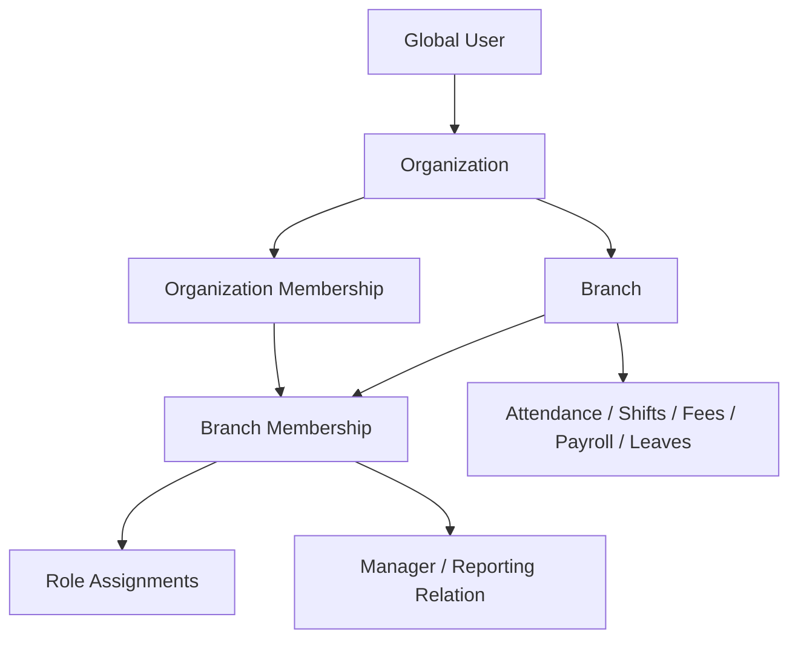
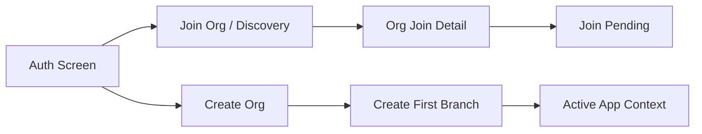

# Organization Management Platform — Unified Product, UX and Engineering Context

> **Document purpose:** Persistent source of truth for humans, Codex, Stitch-generated UI work, implementation, review, testing, and future product decisions.
>
> **Last updated:** 2026-09-09  
> **Status:** Current consolidated blueprint. Newer product/UI decisions in this document supersede the older initial `CONTEXT.md`.  
> **Sources consolidated:** Original product/engineering blueprint + later Stitch screen instructions + subsequent corrections and scope expansion.  
> **Priority rule:** When two requirements conflict, the most recent explicitly confirmed requirement in this file wins. Engineering/security invariants remain mandatory unless a later decision explicitly replaces them.

---

## 1. How Codex and Designers Must Use This File

Read this file before making any product, database, API, authorization, UI, workflow, or naming decision.

### 1.1 Mandatory working rules

1. Treat the hierarchy, tenant isolation, permission model, financial invariants, attendance invariants, payroll history, and screen contracts here as authoritative.
2. Inspect the existing repository before choosing libraries, route names, folder structure, state management, database patterns, or API conventions. Preserve coherent existing conventions unless they conflict with this document.
3. Do not silently invent business rules. Use defaults marked **DEFAULT**. For anything materially irreversible or user-visible that is still **OPEN**, document the assumption before implementing.
4. Every tenant-owned query and mutation must enforce organization and branch scope on the server. UI hiding is never authorization.
5. Protected operations are permission-driven, not hard-coded to role display names, except protected system-role invariants such as the last owner rule.
6. RBAC and reporting hierarchy are separate concepts:
   - **Role/permission = what a member can do.**
   - **Reporting hierarchy = which members/subtree the action can apply to when the permission is team-scoped.**
7. Keep schema, migrations, API contracts, UI behavior, validation, audit logging, notifications, and tests aligned in the same change.
8. Store timestamps in UTC. Preserve date-only business values as local dates. Store branch IANA timezone and calculate attendance/payroll day boundaries in that branch timezone.
9. Store money as integer minor units with ISO currency code. Never use floating-point values for money.
10. Financial ledger entries and finalized payroll/payslip snapshots are append-only historical records. Corrections happen through reversals/revisions, not silent overwrites.
11. Prefer reversible changes, additive migrations, idempotent commands, and backward-compatible API evolution.
12. Never expose cross-tenant identifiers, private member data, attendance selfies, precise location evidence, salary data, payment evidence, or internal traces to unauthorized users.
13. If implementation conflicts with this file, explain the conflict before changing behavior.
14. Whenever a confirmed product decision changes, update this file and append the decision to the Decision Log.

### 1.2 Requirement labels

- **REQUIRED** — confirmed product behavior or engineering/security safeguard.
- **DEFAULT** — use this behavior unless a later explicit product decision changes it.
- **OPEN** — needs product confirmation before irreversible/high-impact behavior.
- **FUTURE** — intentionally outside the current product scope.

### 1.3 Terminology migration

The earlier blueprint used **Location**. The current product-facing term is **Branch**.

- Product/UI/documentation: use `Organization` and `Branch`.
- New code: prefer `organization` and `branch` naming.
- Existing repository code may still contain `location` identifiers. Do not perform a risky mass rename merely for vocabulary. Map legacy `location` to the Branch domain and migrate deliberately.
- A Branch is the primary operational scope for attendance, members, shifts, subscriptions, fees, payroll, leaves, holidays, and day-to-day settings.

---

## 2. Product Summary

The product is a multi-tenant organization management platform. A single global user signs in with Google, may create one or more organizations, may belong to one or more organizations, and may belong to one or more branches inside those organizations.

The product must support organizations that are not limited to one industry. Naming, plans, roles, member types, salary eligibility, subscription rules, and branding are configurable so the same platform can serve gyms, coaching organizations, offices, clubs, service businesses, and similar member/employee organizations.

### 2.1 Core jobs

- Authenticate a global identity once and resolve all organization/branch memberships safely.
- Discover organizations nearby, inspect an organization and its branches, request to join a branch, or create an organization and branch.
- Manage organization profile, branch data, member profiles, reporting hierarchy, roles, and permissions.
- Configure subscriptions/plans and assign them to members/customers.
- Track member payments, payment evidence, pending renewals, ledger history, receipts, fines, and reminders.
- Configure shifts and assign them to members.
- Track self and organization attendance with configurable punch/selfie/location evidence.
- Show currently present members in an interactive ongoing-activity view.
- Mark employee salary eligibility, configure salary structures, generate payroll, and issue payslips.
- Manage leaves, holidays, announcements, notifications, reports, and audit-sensitive operations.
- Present different navigation, data, actions, and data scope according to active organization, branch, role, permission, reporting hierarchy, and record state.

### 2.2 Product goals

- Extremely clean member experience with minimal unnecessary navigation.
- Powerful owner/admin control without turning every manager into an all-powerful administrator.
- One product that scales from a single branch to multiple branches and multiple organizations per user.
- Verifiable attendance with transparent activity history.
- Clear subscriptions and fees with evidence-based payment requests.
- Salary/payroll that is consistent with employee eligibility and historical attendance while preserving finalized payroll history.
- Strict tenant isolation and complete auditability for sensitive operations.
- Custom roles and permission combinations without code changes.
- UI consistency across every generated/implemented screen.

### 2.3 Current non-goals

Unless explicitly added later:

- Workout programming, nutrition plans, or trainer marketplaces.
- Equipment/inventory maintenance.
- External biometric hardware integration.
- Public organization reviews/social feeds.
- Full accounting, GST filing, bank reconciliation, or statutory payroll compliance claims.
- Multiple currencies inside one organization in the first release.
- White-label app binaries per organization.
- A separate platform super-admin business portal.

**Important scope change:** Payroll and salary structure are **not** a future-only item anymore. They are current product scope.

---

## 3. Canonical Terminology and Hierarchy

| Term | Meaning |
| --- | --- |
| `User` | Global authenticated identity, usually created from verified Google identity. |
| `Organization` | Top-level tenant. Owns branding, organization details, reusable roles/plans, and branches. |
| `Branch` | Physical or operational unit under one organization. Primary operational scope. |
| `OrganizationMembership` | A person's organization-specific profile/relationship. May temporarily be unclaimed for assisted admission. |
| `BranchMembership` | A person's active/pending/inactive relationship to one branch, including branch role assignments, member number, shift, subscription and salary eligibility links. |
| `Member` | Generic product term for an accepted person in an organization/branch. Owner/admin/employee/customer can all have member profiles. |
| `Aspirant` | Signed-in user who submitted a branch join request but is not accepted yet. |
| `Owner` | Protected organization owner with organization-wide ownership capabilities. |
| `Admin/Staff` | Operator with configurable permissions. |
| `Employee` | A member marked as employee/staff. Salary eligibility is a separate boolean/state and is not implied by every role. |
| `Manager` | A member who has other members assigned beneath them in the reporting tree. Manager status alone does not grant permissions. |
| `Role` | Named collection of atomic permissions. |
| `Permission` | Atomic server-enforced capability. May include a data scope such as SELF, TEAM, BRANCH or ORGANIZATION. |
| `Reporting hierarchy` | Explicit parent/manager relationship among branch members. Determines team/subtree scope when a team permission is granted. |
| `Subscription Plan` | Reusable commercial membership/subscription template. |
| `Subscription` | A plan assigned to a member for specific dates and snapshotted commercial terms. |
| `Fee/Charge` | Money owed from a subscription, joining fee, fine, or manual adjustment. |
| `Payment Request` | A member-submitted claim that payment was made, usually with evidence, awaiting review when manual evidence flow is used. |
| `Payment` | Confirmed money received against one or more charges. |
| `Ledger` | Immutable financial entries explaining balances and payment history. |
| `Shift` | Reusable attendance/work schedule assigned to members. |
| `Salary Structure` | Effective-dated salary definition for one salary-eligible employee. |
| `Payroll Run` | Payroll generation for a branch and pay period, producing payslips. |
| `Payslip` | Final or draft payroll result for one employee, containing earnings/deductions and period details. |
| `Attendance Session` | One clock-in/clock-out lifecycle with evidence and derived status. |

Use `member` as the neutral code/documentation term. Avoid business-specific labels unless the organization config supplies them.

### 3.1 Tenant hierarchy



### 3.2 Required ownership rules

- `User` is global and must not be duplicated per organization.
- `Organization` is the tenant root.
- Every `Branch` belongs to exactly one organization.
- Every branch-scoped operational record carries both `organization_id` and `branch_id`.
- A user can belong to multiple organizations and branches.
- Owner assignment is organization-scoped; day-to-day owner branch participation is represented by branch memberships.
- Creating a new branch provisions branch membership for current owners when required for branch operations.
- Request-provided organization, branch, member, payroll, attendance, or financial IDs are never trusted without membership and permission validation.

### 3.3 Reporting hierarchy rules

- Each branch membership may optionally have one direct `manager_membership_id` within the same organization/branch scope.
- A member cannot be their own manager.
- Cycles are forbidden.
- The UI may display a tree, grouped cards, or hierarchy path.
- Role does not determine manager hierarchy. A `Sales Manager` role can exist without reports, and a member can have reports without admin permissions.
- Team-scoped permission resolves to the acting member's reporting subtree at request time.
- Re-parenting a member changes future access scope but does not rewrite historical audit actors or payroll/attendance records.

---

## 4. Global UI and Design System

These rules apply to all Stitch generations and implementation unless a later design decision explicitly replaces them.

### 4.1 Visual language

- **Light theme only** for the current product.
- Use the **canonical supplied app logo only** wherever a logo is required. Do not substitute, redraw, recolor arbitrarily, or invent another logo.
- Derive accent/theme direction from the canonical logo while keeping contrast and accessibility intact.
- Font: **Space Grotesk** throughout the product UI.
- Overall scale should be slightly reduced compared with default mobile mockup proportions: smaller but still readable typography, compact controls, disciplined icon sizes, and more visible content per viewport.
- The result must remain **super clean, professional, spacious, calm, and premium**.
- Prefer whitespace, clear grouping, thin dividers, low-noise surfaces, and restrained accent usage.
- Avoid decorative gradients, oversized cards, giant headings, glassmorphism overload, or playful consumer styling unless later branding explicitly asks for it.

### 4.2 Layout rules

- Use a consistent page shell, app bar, spacing grid, input height, border radius family, card padding, divider rhythm, and list density.
- Forms should not place every field in separate giant cards. Group related fields into logical sections.
- Primary action is visually obvious but not oversized.
- Destructive actions use clear confirmation and never rely on color alone.
- Important numeric information should use tabular/consistent alignment where practical.
- Long lists must paginate or progressively load.
- Tab bars must preserve selection during refresh when valid.
- Secondary tab bars should be visually subordinate to primary tab bars.
- Filters should show an active-count indicator when applied.

### 4.3 Shared component vocabulary

Prefer reusable components rather than module-specific clones:

- `AppScaffold`
- `ContextSwitcher`
- `ProfileAvatar`
- `OrgLogo`
- `SectionHeader`
- `SettingsCard`
- `MemberCard`
- `HierarchyMemberCard`
- `RoleChip`
- `StatusChip`
- `MetricCard`
- `Timeline`
- `TimelineEvent`
- `FilterButton` / `FilterSheet`
- `SearchField`
- `PrimaryButton`
- `SecondaryButton`
- `DangerButton`
- `FormSection`
- `EmptyState`
- `ErrorState`
- `SkeletonState`
- `EvidenceBadge`
- `EvidenceViewer`
- `MoneyAmount`
- `DateRangePicker`
- `BranchSelector`
- `PermissionToggleRow`
- `SalaryBreakdown`
- `PayslipCard`
- `SubscriptionCard`

### 4.4 Required states for every screen

Every data screen must define:

1. Loading/skeleton.
2. Empty state with appropriate next action.
3. Error/retry.
4. Offline/stale if cached content is shown.
5. Forbidden/insufficient permission.
6. Normal populated state.
7. Mutation success confirmation where applicable.
8. Validation error state for forms.

Financial, payroll, role, hierarchy, and destructive changes must use confirmation where risk warrants it.

---

## 5. App Navigation and Context Resolution

### 5.1 Session/context startup

1. Restore secure session if available.
2. Verify/refresh session with backend.
3. Resolve accessible organization/branch contexts.
4. If the user has no membership/context, enter the Auth/Join/Create flow.
5. If exactly one active branch context is available, enter it automatically.
6. If multiple contexts exist, restore the last valid context or show a context selector.
7. Context change refreshes permissions, branch config, navigation, cached scoped queries, and sensitive views.

### 5.2 Primary navigation

**Owner/Admin/authorized staff:**

1. Attendance
2. Fees
3. Organization

**Standard member:**

1. Attendance
2. Fees

Organization/settings features remain permission-aware. Profile, notifications, organization switcher, and settings may be reached from the app bar/profile entry.

### 5.3 Dynamic navigation

- Route visibility uses effective server-returned permissions.
- Data/action visibility additionally checks record state and scope.
- Direct navigation to a hidden route must still fail server authorization.
- Permission/hierarchy changes must invalidate the authorization context promptly.
- A member may see the same screen shell as an admin but receive only self-scoped content/actions.

---

## 6. Authentication and Organization Onboarding Module

### 6.1 Flow overview



### 6.2 Screen A1 — Auth Screen

**Purpose:** Minimal first-touch authentication.

**Audience:** Unauthenticated user or signed-out user.

**Layout/content:**

- Canonical logo in a restrained placement.
- Themed illustration/graphics occupy most of the screen.
- Exactly one main authentication action: **Continue with Google**.
- Minimal legal/support copy if required.
- No email/password form in the current release.

**Actions:**

- Continue with Google.
- Open Terms/Privacy only if required.

**Backend behavior:**

- Verify Google token server-side.
- Upsert exactly one global user per provider subject.
- Do not create duplicate users on callback retry.
- Return available organization/branch memberships and states.

**States:** default, Google flow in progress, auth cancelled, network error, disabled-account state.

### 6.3 Screen A2 — Join Organization / Discovery Screen

**Purpose:** Find organizations to join.

**Audience:** Authenticated user without desired branch membership, or an existing user adding another organization.

**Layout/content:**

- Search field at top.
- Nearby/famous/recommended organizations based on coarse/current location when permission is available.
- Organization cards show: logo, organization name, category/type if configured, short address/locality, distance when available, joinability, branch count, and compact public metadata.
- Search results and recommendations are paginated/progressively loaded. Never hard-code a fixed number of organizations.
- Create Organization secondary action remains accessible.

**Search:** name, branch, locality, organization code if supported.

**Privacy:** Public discovery never reveals private member names, salaries, attendance, phone lists, or internal hierarchy.

**States:** location permission denied, no nearby organizations, no search results, network failure, loading.

### 6.4 Screen A3 — Organization Join Detail Screen

**Purpose:** Inspect an organization and select a branch to join.

**Layout/content:**

- Organization hero: logo, name, description, category, public contact, website/social link if configured.
- Public organization summary: branch count, broad member count only if organization allows it, established date if configured, operating status.
- **Members hierarchy preview:** only safe/public hierarchy information approved for discovery. Default is role/leadership summary rather than exposing all private members. Full hierarchy is visible only after membership/permission grants.
- Branch section with a card per joinable branch:
  - branch name
  - address/locality
  - open/closed/joinable status
  - contact
  - working/operating hours when available
  - available subscriptions/plans summary if public
  - distance if available
  - **Join this Branch** action
- Branch selection is explicit. A join request is branch-specific.

**Join action:** opens admission form/sheet if required, then creates one pending request per user + branch.

**States:** already member, already pending, rejected with retry allowed, branch not accepting requests, suspended/inactive organization.

### 6.5 Screen A4 — Create Organization Screen

**Purpose:** Explain organization creation and collect required organization data.

**Top informational section:**

- What an organization is in this product.
- Organization can contain multiple branches.
- Creator becomes protected owner.
- Owner can later configure roles, members, subscriptions, attendance, shifts, fees, and payroll.

**Form fields:**

- Organization name.
- Logo upload (canonical organization logo, separate from app logo).
- Organization type/category.
- Description/about.
- Primary contact name.
- Phone.
- Email.
- Website optional.
- Default timezone.
- Default currency (INR default for first release).
- Registered/general address optional depending on organization type.
- Organization code/slug if supported.

**Validation:** unique slug/code where applicable, normalized phone/email, supported timezone/currency.

**Create behavior:** create organization in DRAFT, create owner organization membership, then require first branch creation before organization becomes operational.

### 6.6 Screen A5 — Create Branch Screen

**Purpose:** Create the first or an additional branch.

**Form fields:**

- Branch name.
- Branch code optional/auto-generated.
- Address lines, locality, city, state, postal code, country.
- Map coordinates from location picker when used.
- Contact phone/email.
- Branch timezone, prefilled from organization/default/device but editable.
- Working days/hours optional.
- Branch status.
- Join requests enabled toggle.
- Attendance enabled toggle.
- Initial attendance defaults: punch/selfie/location/geofence requirements when relevant.
- Optional branch cover/photo.

**First branch transaction:**

- Validate organization ownership.
- Create branch.
- Seed protected system roles if not already available.
- Provision owner branch membership.
- Activate organization if minimum requirements are satisfied.
- Audit all changes.

### 6.7 Supporting auth/onboarding screens

#### Join Pending

- Organization and branch summary.
- Submitted time.
- Pending status.
- Optional cancel request if branch policy permits.
- Explanation that protected branch features remain unavailable until approval.

#### Join Rejected

- Rejected state.
- Reason only when sender chose to share it.
- Retry/reapply when policy allows.

#### Context Selector

- List organizations and branches the user can access.
- Clearly show role/status in each.
- Remember last valid context locally.
- Never let a client-selected context bypass backend membership checks.

---

## 7. Organization Management Module

The Organization module is the primary owner/admin configuration surface. It uses the same global design system and light theme.

### 7.1 Screen O1 — Settings Page

**Purpose:** Central entry point for organization and personal configuration.

**Cards/sections:**

1. **Profile Card**
   - avatar
   - member name
   - email/phone summary
   - current role(s)
   - branch
   - `Edit Profile`

2. **Organization Card**
   - organization logo/name
   - active branch summary
   - organization status
   - `Edit Organization`

3. **Roles & Permissions Card**
   - role count
   - short permission summary
   - `Configure Roles`

4. **Members Card**
   - active/pending/requested counts
   - hierarchy summary
   - `Manage Members`

5. **Subscriptions Card**
   - active subscription-plan count
   - branch availability summary
   - `Configure Subscriptions`
   - visible only to permissions that can configure plans/subscriptions.

6. **Shift Card**
   - active shift count
   - members unassigned count where useful
   - `Configure Shifts`

7. **Payroll Card**
   - salary-eligible employee count
   - current payroll status
   - `Payroll & Salary Structure`

8. Optional existing operational cards when permitted: Holidays, Leaves, Announcements, Reports/Audit.

9. **Logout**
   - visually separated from configuration cards.
   - confirmation optional depending on product behavior.

### 7.2 Screen O2 — Edit Profile Page

**Purpose:** Update the current user's organization/member profile fields.

**Fields:**

- profile photo
- full name
- phone
- optional personal/contact fields configured by organization
- emergency contact if organization uses it
- address fields if collected
- member-facing notes that are self-editable

**Read-only:** membership number, branch, protected role assignments, manager, salary structure, join date unless specific permission allows editing through admin surfaces.

**Actions:** Save changes, discard changes.

**Security:** a member editing their own profile cannot self-assign a role, shift, subscription, manager, salary eligibility, or salary amount.

### 7.3 Screen O3 — Edit Organization Page

**Purpose:** Edit organization-level identity/configuration and browse/edit branches.

**Organization form section:**

- organization name
- logo
- type/category
- description
- primary contact
- phone/email
- website
- default timezone
- default currency
- address/general metadata
- active/archive controls subject to permission

**Middle tab bar: Branches**

- one tab per branch when branch count is small enough
- for many branches, use horizontally scrollable tabs or branch selector
- each tab loads the branch page/form below
- `+ Create Branch` action when permitted

### 7.4 Screen O4 — Branch Detail/Edit Page

This is the branch page shown inside/after the branch tab selection from Edit Organization.

**Fields/data:**

- branch name/code
- address/map
- contact
- timezone
- status
- working hours
- join request enabled
- member/admission defaults
- attendance config summary
- active plans/subscriptions summary
- shift summary
- payroll enabled/config summary if applicable
- branch ownership/admin summary

**Actions:** Edit/save, archive branch, open attendance policy, open branch members, open branch-specific subscriptions/shifts/payroll where permitted.

**Rule:** archive rather than hard-delete when operational/financial/payroll/attendance history exists.

### 7.5 Screen O5 — Roles & Permissions Page

**Primary interaction:** tabs for roles. Each role tab displays the permission groups and toggles for that role.

**Role tab content:**

- role name
- role description
- role scope (organization reusable or branch-local if supported)
- protected/system badge
- assigned member count
- grouped permission toggles
- data-scope selector when permission supports SELF / TEAM / BRANCH / ORGANIZATION

**Permission groups:**

- Organization & Branch
- Members & Admissions
- Roles & Permissions
- Attendance
- Shift/Leave/Holiday
- Subscription/Fees
- Payroll/Salary
- Announcements
- Reports/Audit

**Actions:** create role, rename custom role, clone role, edit permission toggles, delete custom unused role, assign role from Members screen.

**Invariants:**

- `OWNER` cannot lose protected full-access invariant.
- System role keys cannot be deleted.
- Organization must retain at least one active owner.
- Permission changes are audited and refresh affected sessions/context promptly.

### 7.6 Screen O6 — Members Page

**Purpose:** View and manage all people in the active organization/branch according to permission.

**Primary tabs:**

- role-based tabs such as All, Owner, Admin, Employee, Member, plus custom roles where useful
- status tabs/segments for **Joined/Active**, **Requested/Pending**, Suspended/Inactive when applicable

The exact visual implementation may combine role and status without creating an unreadable forest of tabs. One dimension can be a primary tab bar and the other a segmented filter.

**Member card:**

- avatar
- name
- membership number
- role(s)
- branch
- reporting manager
- direct report count when relevant
- shift
- subscription status
- employee/salary eligibility badge
- attendance/current-presence summary when permitted
- `Configure Member`

**Hierarchy view:**

- toggle between list and hierarchy/tree view when useful
- owner/top members appear at roots
- expandable manager nodes
- hierarchy is based on explicit manager relation, not role name

**Requested member card:** applicant name, requested branch, requested time, admission data summary, evidence/docs if collected, approve/reject actions when permitted.

### 7.7 Screen O7 — Configure Member Page

**Purpose:** Administrative configuration of one branch member.

**Sections:**

1. Member/profile summary.
2. Membership status: active/suspended/inactive.
3. Branch assignment/history when cross-branch movement is supported.
4. Assign one or more roles.
5. Assign reporting manager / change hierarchy parent.
6. **Assign Shift.**
7. **Assign Subscription.**
8. **Employee eligible for salary?** toggle/state.
9. If salary eligible: **Configure Salary Structure** action leading to Salary Structure Form Page.
10. Attendance/permission-sensitive admin notes where supported.

**Validations:**

- manager must be valid and cycle-free
- role assignment must be within compatible scope
- shift belongs to branch
- subscription is valid for branch/member
- salary structure cannot be configured unless salary eligibility is enabled
- cannot remove the final owner or create an ownerless organization

---

## 8. Subscription Configuration Module

### 8.1 Screen S1 — Subscription Configuration Page

**Purpose:** Owner/admin defines reusable subscriptions/plans available to customers/members.

**Primary tab bar:** one tab per subscription plan. Include `+ Add Subscription` when permitted.

**Each subscription tab contains an editable form:**

- name
- description
- active/inactive
- applicable branches
- duration type/value
- base amount
- currency
- joining fee optional
- tax metadata optional
- discount metadata optional
- grace days
- benefits/limits structured fields when actually used
- renewal rules
- public visibility in organization discovery optional
- sort/order display optional

**Actions:** save, duplicate, deactivate/archive, add new.

**Historical rule:** editing a plan never mutates commercial terms already snapshotted into existing subscriptions.

### 8.2 Plan and subscription distinction

- Plan = reusable template configured here.
- Subscription = one assigned instance for one member with start/end dates and agreed price snapshot.
- Renewals create a new subscription or linked renewal record; history is never erased.
- Overlap is denied by default except non-overlapping future renewal.

---

## 9. Shift Configuration Module

### 9.1 Screen SH1 — Shift Page

**Primary tab bar:** one tab per configured shift, plus `+ Add Shift`.

**Each shift tab form:**

- shift name
- start local time
- end local time
- overnight indicator derived when end crosses date boundary
- break policy/duration
- weekly work pattern
- effective start/end dates optional
- early arrival allowance
- late grace
- early-leave threshold
- minimum/expected duration
- active/inactive
- branch assignment/scope

**Assignment:** members receive effective shift assignment from Configure Member or bulk assignment tools.

**History rule:** changing a shift does not rewrite historical attendance. Attendance stores the effective shift snapshot used at that time.

---

## 10. Attendance Module

### 10.1 Screen AT1 — Self Attendance Page

**Purpose:** Main self punch and live session screen.

**Hero/interaction area:**

- current date and live time
- large but restrained fingerprint/punch affordance
- state-aware CTA: `Clock In` or `Clock Out`
- clear session state

**When not clocked in:**

- scheduled shift
- allowed clock-in window/status
- evidence that will be required: selfie, location, confirmation
- branch name
- attendance policy summary

**When currently clocked in:**

- ongoing worked duration timer
- clock-in time
- clock-in method/evidence badges
- selfie captured indicator
- location verified indicator/geofence status
- shift status and late/on-time result
- branch
- device/session info only when useful
- next action: Clock Out

**Activity timeline:**

- session opened
- selfie captured
- location verified
- clock-in confirmed
- breaks/events if feature exists
- clock-out when completed
- correction/status events where user may see them

**Punch flow:** gather required evidence according to effective policy, then submit idempotent command. UI becomes confirmed only after server success.

### 10.2 Screen AT2 — Self Attendance Record Page

**Primary tabs:**

- This Week
- This Month
- Custom

**Custom tab:** filter button/date range selector.

**Summary area:** present days, late days, absent/leave/holiday as applicable, total worked duration, expected duration where known.

**Daily record card:**

- date/work day
- status
- shift
- in/out times
- worked duration
- late/early minutes
- evidence indicators
- correction indicator

**Expanded/detail timeline:** full allowed activity timeline for that day/session.

### 10.3 Screen AT3 — All Attendance Record Page

**Audience:** owner/admin/manager only with appropriate scope.

**Primary tabs:** role-based/member-group tabs appropriate to current branch. Tabs are permission-aware.

**Global filter:** top-right filter button applies to the whole screen. Filters may include:

- date/date range
- role
- manager/team
- member
- shift
- attendance status
- evidence issue
- currently open/closed

**Record cards:** member identity, date, in/out, duration, status, shift, evidence badges, hierarchy/role summary where useful.

**Tap:** Attendance Detail.

### 10.4 Screen AT4 — Ongoing Activity Page

**Purpose:** Visually compelling live view of members currently present/clocked in.

**UI:**

- live count and last refresh time
- optional summary metrics: on-time, late, overtime threshold, evidence issue
- interactive grid/list of active member cards
- avatar, name, role, manager/team, shift, clock-in time, elapsed duration, status
- subtle progress/time visualization, not a casino dashboard
- quick filters by role/team/shift
- tap member to open current Attendance Detail

**Refresh:** server polling/realtime event model according to existing stack. Must remain branch-scoped.

### 10.5 Screen AT5 — Attendance Detail Page

**Data:**

- member summary
- logical work date
- branch/timezone
- assigned shift snapshot
- clock-in/out server and captured times
- worked duration
- derived status
- late/early data
- evidence details allowed by permission
- map/location summary when authorized
- selfie viewer when authorized
- device metadata when authorized
- activity timeline
- correction history/audit references

**Admin actions:** correct attendance, close missing session, void/manual record only with explicit permission and reason.

### 10.6 Screen AT6 — Attendance Correction Form

- original values shown read-only
- corrected in/out/status fields as allowed
- reason mandatory
- actor and timestamp recorded
- original evidence remains immutable
- confirmation required

### 10.7 Attendance policy

Multiple attendance policies will be managed centrally in Settings and assigned directly to employees, rather than being a single branch-level configuration.

- `punch_required`
- selfie required on clock-in and/or clock-out
- location required on clock-in and/or clock-out
- geofence enabled, center, radius, acceptable accuracy
- shift enforcement enabled
- early-arrival allowance
- late grace
- minimum session duration
- maximum open-session duration
- manual record allowance
- offline capture allowance
- evidence retention policy
- policy version and effective date

Attendance session stores the policy version used.

### 10.8 Attendance business rules

- One open session per branch membership unless a later multi-session mode is explicitly added.
- Server timestamp is authoritative; client captured time is diagnostic/offline metadata.
- Required GPS must be fresh and accurate enough; missing required evidence is rejected.
- Selfie evidence is live capture by default; gallery upload disabled.
- Duplicate clock-in/out uses idempotency key and returns original result or conflict safely.
- Overnight shift attendance belongs to the shift's logical work date.
- Attendance correction appends corrected values and audit metadata rather than overwriting original evidence.
- Approved leave/holiday/attendance precedence must be deterministic.

### 10.9 Attendance statuses

`PRESENT`, `LATE`, `LEFT_EARLY`, `HALF_DAY`, `ABSENT`, `ON_LEAVE`, `HOLIDAY`, `WEEK_OFF`, `INCOMPLETE`, `MANUAL`, `VOID`.

---

## 11. Payroll and Salary Module

Payroll is current scope and is branch/employee-aware.

### 11.1 Salary eligibility

- A member may be marked `employee`/staff without necessarily being salary-eligible.
- Configure Member contains **Employee eligible for salary**.
- Salary structure actions are hidden/disabled until eligibility is enabled.
- Disabling salary eligibility must not delete past salary structures or payslips.

### 11.2 Screen P1 — Payroll Page

**Primary tab bar:**

1. **Payroll**
2. **Salary Structure**

#### Payroll tab — secondary tabs

- This Month
- Last Month
- Custom

**Payroll content:**

- period summary
- payroll run status
- salary-eligible employee count
- generated/draft/finalized/paid counts
- total gross, deductions, net pay
- payslip cards for each employee
- generate payroll action when permitted
- finalize/approve/pay actions subject to defined workflow and permission

**Payslip card:** employee, role, pay period, gross, deduction, net, status, attendance/payable-days summary.

#### Salary Structure tab — secondary tabs

Role-based tabs. Each tab displays salary-eligible employee cards for that role.

**Employee salary card:**

- employee name/avatar
- role
- branch
- effective salary structure date
- base/gross summary
- recurring earnings/deductions summary
- current shift
- `Edit Salary Structure`

### 11.3 Screen P2 — Salary Structure Form Page

Opened from Configure Member or Salary Structure employee card.

**Fields/sections:**

- employee summary, role, branch
- effective-from date
- pay frequency (monthly default)
- base/basic pay
- earnings components, each with name/type/value
- deductions components, each with name/type/value
- fixed or percentage calculation mode where supported
- attendance/payable-day rules
- overtime component/rule only if product enables it
- unpaid leave/absence effect
- notes
- status active/inactive

**Rules:**

- effective-dated versions; editing creates/updates future/current version safely without rewriting finalized historical payslips.
- monetary components use minor units.
- structure must belong to salary-eligible employee.
- percentage components must define valid base.
- total/net preview shown before save.

### 11.4 Screen P3 — Payroll Period / Detail Page

**Purpose:** Inspect one payroll run/pay period and all payslips.

**Data:**

- branch and pay period
- run status
- generated by/time
- salary structure version snapshot references
- attendance input summary
- total gross/deductions/net
- warning count
- payslip list

**Actions:** regenerate draft before finalization, resolve warnings, approve/finalize, mark payment where supported, export authorized report.

### 11.5 Screen P4 — Payslip Detail Page

**Data:**

- organization/branch identity
- employee name/member number/role
- pay period
- salary structure effective version
- payable days, present/leave/absence data used
- earnings line items
- deductions line items
- gross
- total deductions
- net pay
- payment status/method/reference if tracked
- generated/finalized timestamps
- revision reference if corrected

**Actions:** view/download/share according to implementation, mark paid or correct only through approved payroll workflow, never edit finalized line items in place.

### 11.6 Suggested payroll lifecycle

`DRAFT → GENERATED → REVIEWED/APPROVED → FINALIZED → PAID`

A branch may simplify intermediate states, but finalized history is immutable. Corrections produce a revision/adjustment rather than mutating an issued payslip.

### 11.7 Payroll attendance interaction

**DEFAULT:** payroll may consume attendance/shift/leave summaries to calculate payable days, but the exact salary formula is organization-configurable. The payroll engine must snapshot the inputs used so later attendance correction does not silently change a finalized payslip.

---

## 12. Fees and Member Subscription Purchase Module

### 12.1 Screen F1 — Fees Page

**Primary tabs:**

- This Month
- Last Month
- Custom

**Secondary tabs inside each period:**

1. **Paid**
2. **Requested**
3. **Pending**

A global filter may further filter branch/member/plan/payment method/status.

#### Paid

Shows confirmed fee/subscription payments relevant to the selected period.

A payment can appear for the selected month even when paid earlier if the associated subscription coverage applies to that month. Display both payment date and subscription coverage dates so the meaning is unambiguous.

**Card data:**

- member
- subscription/plan
- coverage dates
- payment date
- amount
- payment method
- receipt/status
- evidence badge if manual evidence was used
- balance after payment when useful

#### Requested

Shows member-submitted payment requests with evidence that are awaiting review/confirmation.

**Card data:** member, selected subscription, claimed amount, submitted time, payment method/reference, evidence thumbnail/attachment indicator, review status.

**Admin actions:** open evidence, approve/confirm, reject with reason, request more information if feature exists.

A `REQUESTED` payment is never counted as paid until confirmed.

#### Pending

Shows members who should renew/pay but do not have valid subscription coverage for the relevant period.

**DEFAULT derivation:** active branch members who have recent/ongoing attendance or active membership status, but no valid renewed subscription covering the period. The UI should explain why each member is considered pending.

**Card data:** member, last subscription, expiry date, current activity/attendance indicator, amount due when determinable, quick reminder/action.

### 12.2 Screen F2 — Buy Subscription Page

**Audience:** member purchasing/requesting a subscription for self, or authorized staff assigning/purchasing for a member.

**Card-based flow:**

1. Select subscription plan.
2. Show plan price, duration, branch availability, description/benefits.
3. Confirm start date and calculated coverage/end date.
4. Show amount/discount/fees.
5. Choose supported payment method.
6. Add payment evidence when manual/offline payment requires it:
   - image/document
   - reference/transaction ID
   - optional note
7. Review card.
8. Submit.

**Result:**

- gateway payment becomes confirmed only after authoritative success/webhook.
- manual evidence payment becomes `REQUESTED` until authorized review confirms it.
- subscription activation rules depend on payment/organization policy and must be explicit.

### 12.3 Screen F3 — Fee/Payment Detail

- member
- charge/subscription
- amount due/paid
- allocations
- payment request/evidence history
- confirmed payment data
- receipt
- reversals/refunds/adjustments
- audit-visible actions according to permission

### 12.4 Screen F4 — Payment Evidence Viewer/Review

- safe evidence preview
- claimed amount/reference
- submitter/time
- linked subscription/charge
- approve/confirm
- reject with mandatory reason
- audit record

### 12.5 Financial rules

- Subscription assignment snapshots plan price/terms.
- Generate charges and append-only ledger entries.
- Partial payments are supported.
- Payment amount must be positive.
- Failed/pending/requested payment is not paid.
- Gateway webhook is authoritative for async gateway completion and must be signature-verified/idempotent.
- Never edit a posted ledger entry. Reverse with a linked compensating entry.
- Refund/void requires special permission and audit.
- Receipt number must be unique within selected organization/branch numbering policy.

---

## 13. Members, Admissions and Hierarchy Domain

### 13.1 Member lifecycle

`PENDING_REQUEST → ACTIVE → SUSPENDED | INACTIVE`

Join request lifecycle:

`PENDING → APPROVED | REJECTED | CANCELLED`

### 13.2 Join approval transaction

On approval:

1. Lock pending request to prevent double processing.
2. Create/reuse organization membership.
3. Create active branch membership.
4. Assign configured default member role.
5. Generate branch-unique membership number.
6. Set manager relation if admission workflow selected one.
7. Optionally assign shift.
8. Optionally assign subscription and opening charge.
9. Mark request approved.
10. Write audit and notification events.
11. Refresh effective context immediately.

### 13.3 Assisted admission/invitation

Authorized staff may create an unclaimed organization membership/invitation for someone who has not installed the app. Later verified sign-in claims that profile. Do not create duplicate permanent global users.

### 13.4 Member detail information

A complete member detail view or API may include, permission permitting:

- profile/contact
- organization/branch membership history
- member number
- status
- roles/permissions summary
- manager and reporting path
- direct/indirect reports
- shift
- attendance summary/history
- subscriptions and fee balance/history
- salary eligibility
- salary structure/payslip access according to permission
- leaves
- notes
- audit-visible administrative actions

---

## 14. Leave, Holiday and Workforce Rules

### 14.1 Leave

Lifecycle: `PENDING → APPROVED | REJECTED | CANCELLED`.

- Member creates leave for self unless granted admin/team permission.
- Approver scope follows permission + reporting/branch scope.
- Approval/rejection records actor, time, and optional note.
- Overlapping duplicate leave is rejected or explicitly resolved.
- Cancelling approved leave after attendance/payroll usage requires an explicit resolution path.

### 14.2 Holidays

- Holiday has local date, name, organization/branch scope, optional recurrence metadata.
- Branch-specific exception overrides organization-wide calendar.
- Payroll and attendance must use the same resolved work-calendar snapshot for historical calculations.

### 14.3 Shift assignment

- Shift may be assigned directly to member or through a role/bulk operation, but effective member-level assignment must be resolvable.
- Changes are effective-dated when historical accuracy matters.

---

## 15. Announcements, Notifications, Reports and Audit

### 15.1 Announcements

Statuses: `DRAFT`, `SCHEDULED`, `PUBLISHED`, `EXPIRED`, `CANCELLED`.

Audience:

- all active branch members
- selected roles
- selected reporting team/subtree when supported
- selected members
- organization-wide audience when authorized

Store recipient snapshot at publication so later hierarchy/role changes do not rewrite historical audience.

### 15.2 Notifications

Generate events for at least:

- join request submitted/approved/rejected
- invitation created/expiring
- role/critical membership change where useful
- announcement published
- subscription assigned/expiring/expired/renewed
- fee/payment request submitted/approved/rejected
- payment received/failed and receipt generated
- shift assignment/change
- leave submitted/approved/rejected
- attendance anomaly/missing clock-out
- payroll generated/finalized/paid and payslip available

### 15.3 Reports

At minimum:

**Attendance:** present/late/absent/on-leave, currently clocked in, average duration, missing clock-outs/evidence failures.

**Members:** active/pending/suspended/inactive, new admissions, members by role/plan/manager.

**Fees:** collected, requested, outstanding, overdue, refunded, adjusted, expiring subscriptions, collection by method/plan.

**Payroll:** salary-eligible count, total gross/deductions/net by period, payroll status counts, unpaid payslips, variance from previous period where useful.

Every dashboard/report discloses selected organization, branch, date range/pay period, timezone, and last refresh time.

### 15.4 Audit log

Audit at least:

- organization/branch create/update/archive
- role/permission/assignment changes
- manager hierarchy changes
- join approval/rejection and member status changes
- shift assignment/policy changes
- attendance corrections/manual/voids/policy changes
- plan/subscription/payment/evidence/fine/refund/void/adjustment operations
- salary eligibility changes
- salary structure create/update/effective-date changes
- payroll generation/finalization/revision/payment status changes
- announcement publication/deletion
- sensitive exports

Audit entry includes actor, organization, branch, action, target type/ID, timestamp, request ID, safe before/after diff, source and reason when required.

---

## 16. Authorization Model

### 16.1 Permission naming

Use stable uppercase codes. Prefer `RESOURCE_ACTION_SCOPE` where scope is meaningful.

Scopes:

- `SELF`
- `TEAM` — actor's reporting subtree
- `BRANCH`
- `ORGANIZATION`

Not every permission requires every scope.

### 16.2 Core permission catalog

#### Organization and branch

- `ORG_READ`
- `ORG_UPDATE`
- `ORG_ARCHIVE`
- `BRANCH_READ`
- `BRANCH_CREATE`
- `BRANCH_UPDATE`
- `BRANCH_ARCHIVE`
- `BRANCH_SETTINGS_UPDATE`

#### Roles and hierarchy

- `ROLE_READ`
- `ROLE_CREATE`
- `ROLE_UPDATE`
- `ROLE_DELETE`
- `ROLE_ASSIGN`
- `HIERARCHY_READ_TEAM`
- `HIERARCHY_READ_BRANCH`
- `HIERARCHY_MANAGE`

#### Members/admissions

- `MEMBER_READ_SELF`
- `MEMBER_READ_TEAM`
- `MEMBER_READ_BRANCH`
- `MEMBER_READ_ORGANIZATION`
- `MEMBER_CREATE`
- `MEMBER_UPDATE_SELF`
- `MEMBER_UPDATE_TEAM`
- `MEMBER_UPDATE_BRANCH`
- `MEMBER_SUSPEND`
- `MEMBER_DEACTIVATE`
- `JOIN_REQUEST_READ`
- `JOIN_REQUEST_APPROVE`
- `JOIN_REQUEST_REJECT`

#### Attendance

- `ATTENDANCE_READ_SELF`
- `ATTENDANCE_READ_TEAM`
- `ATTENDANCE_READ_BRANCH`
- `ATTENDANCE_CREATE_SELF`
- `ATTENDANCE_CREATE_OTHER`
- `ATTENDANCE_UPDATE`
- `ATTENDANCE_CORRECT`
- `ATTENDANCE_VOID`
- `ATTENDANCE_EXPORT`
- `ATTENDANCE_EVIDENCE_READ`

#### Workforce

- `SHIFT_READ_SELF`
- `SHIFT_READ_TEAM`
- `SHIFT_READ_BRANCH`
- `SHIFT_MANAGE`
- `LEAVE_READ_SELF`
- `LEAVE_READ_TEAM`
- `LEAVE_READ_BRANCH`
- `LEAVE_CREATE_SELF`
- `LEAVE_MANAGE`
- `HOLIDAY_READ`
- `HOLIDAY_MANAGE`

#### Subscription and fees

- `PLAN_READ`
- `PLAN_MANAGE`
- `SUBSCRIPTION_READ_SELF`
- `SUBSCRIPTION_READ_TEAM`
- `SUBSCRIPTION_READ_BRANCH`
- `SUBSCRIPTION_CREATE`
- `SUBSCRIPTION_UPDATE`
- `SUBSCRIPTION_CANCEL`
- `PAYMENT_READ_SELF`
- `PAYMENT_READ_TEAM`
- `PAYMENT_READ_BRANCH`
- `PAYMENT_CREATE`
- `PAYMENT_REQUEST_REVIEW`
- `PAYMENT_EVIDENCE_READ`
- `PAYMENT_REFUND`
- `PAYMENT_VOID`
- `FINE_READ_SELF`
- `FINE_READ_BRANCH`
- `FINE_MANAGE`
- `REMINDER_READ_SELF`
- `REMINDER_READ_BRANCH`
- `REMINDER_MANAGE`

#### Payroll and salary

- `SALARY_ELIGIBILITY_MANAGE`
- `SALARY_STRUCTURE_READ_SELF`
- `SALARY_STRUCTURE_READ_TEAM`
- `SALARY_STRUCTURE_READ_BRANCH`
- `SALARY_STRUCTURE_MANAGE`
- `PAYROLL_READ_SELF`
- `PAYROLL_READ_TEAM`
- `PAYROLL_READ_BRANCH`
- `PAYROLL_GENERATE`
- `PAYROLL_APPROVE`
- `PAYROLL_FINALIZE`
- `PAYROLL_MARK_PAID`
- `PAYROLL_EXPORT`

#### Communication/reporting/audit

- `ANNOUNCEMENT_READ`
- `ANNOUNCEMENT_CREATE`
- `ANNOUNCEMENT_UPDATE`
- `ANNOUNCEMENT_DELETE`
- `REPORT_READ`
- `REPORT_EXPORT`
- `AUDIT_READ`

### 16.3 Seed roles

| System key | Display | Protected | Default behavior |
| --- | --- | --- | --- |
| `OWNER` | Owner | Yes | Trusted full organization access; assignment protected. |
| `ADMIN` | Admin | Role key protected; permissions configurable by owner | Broad operational permissions but not ownership transfer by default. |
| `MEMBER` | Member | Yes | Organization/branch read, self attendance, self fees/subscription, own payslip if employee, announcements/self-service. |

Custom roles are allowed.

### 16.4 Role invariants

- System role keys cannot be deleted.
- Owner access cannot be accidentally reduced below protected ownership invariant.
- At least one active owner must remain.
- Only owner may transfer ownership or assign/remove protected owner assignment.
- Role assignments attach to organization/branch membership, never directly to global user.
- Custom role names are unique within their scope case-insensitively.

### 16.5 Authorization evaluation

For every protected request:

1. Authenticate global user.
2. Resolve requested organization and branch.
3. Verify active membership in that context.
4. Reject archived/suspended context as appropriate.
5. Load effective role assignments and permissions.
6. If permission is team-scoped, resolve current reporting subtree.
7. Verify target resource belongs to same organization/branch and permitted data scope.
8. Apply record-state business rules.
9. Audit sensitive mutation and meaningful security denial as appropriate.

---

## 17. Domain Data Model

Logical model only. Adapt names to repository conventions without changing ownership/invariants.

| Entity | Purpose | Required scope |
| --- | --- | --- |
| `User` | Global identity/base profile | Global |
| `AuthIdentity` | Provider subject linked to user | Global; unique provider+subject |
| `Organization` | Tenant root | Self |
| `Branch` | Operational branch | `organization_id` |
| `OrganizationMembership` | Organization-specific person profile | `organization_id`, optional `user_id` before claim |
| `BranchMembership` | Person-to-branch relationship | `organization_id`, `branch_id`, `organization_membership_id` |
| `ReportingRelation` or manager field | Manager hierarchy | branch membership scope |
| `JoinRequest` | Join/admission request | org + branch + user |
| `Role` | Permission bundle | organization; optional branch-local |
| `Permission` | Canonical permission | system/global |
| `RolePermission` | Role→permission | role scope |
| `RoleAssignment` | Membership→role | organization/branch compatible scope |
| `AttendancePolicy` | Evidence/timing rules | org + branch; optional role override |
| `AttendanceSession` | Clock lifecycle | org + branch + branch membership |
| `AttendanceEvidence` | Selfie/location/device evidence | attendance scope |
| `Shift` | Reusable schedule | org + branch |
| `ShiftAssignment` | Member effective shift | branch membership |
| `LeaveRequest` | Leave lifecycle | org + branch + branch membership |
| `Holiday` | Work calendar exception | org; optional branch |
| `SubscriptionPlan` | Reusable commercial plan | org; branch availability |
| `Subscription` | Member plan snapshot | org + branch + branch membership |
| `Charge` / `LedgerEntry` | Immutable debit/credit | financial scope |
| `PaymentRequest` | Evidence-backed claimed payment | org + branch + member |
| `PaymentEvidence` | Uploaded proof/reference | payment request scope |
| `PaymentAttempt` | Manual/gateway lifecycle | financial scope |
| `PaymentAllocation` | Payment/credit to charges | financial scope |
| `Receipt` | Payment acknowledgement | financial scope |
| `SalaryStructure` | Effective-dated employee compensation config | org + branch + member |
| `SalaryComponent` | Earning/deduction definition/snapshot | salary structure/payslip |
| `PayrollRun` | Branch/pay-period payroll | org + branch |
| `Payslip` | Employee pay-period result | org + branch + member + payroll run |
| `PayslipLine` | Earnings/deductions | payslip |
| `Reminder` | Scheduled/ad-hoc notification | org + branch + target |
| `Announcement` | Targeted content | org; optional branch |
| `AnnouncementRecipient` | Publication audience snapshot | announcement scope |
| `MediaAsset` | Private logo/evidence/selfie/attachment metadata | tenant scope |
| `Notification` | Delivery/read state | recipient + tenant |
| `AuditLog` | Append-only sensitive operation trail | org; optional branch |

### 17.1 Common fields

Tenant-owned mutable entities generally include:

- stable UUID/ULID ID
- `organization_id`
- `branch_id` when operationally branch-scoped
- `created_at`, `updated_at`
- `created_by`, `updated_by`
- optimistic `version` when concurrent edits matter
- `archived_at`, `archived_by` when history requires soft removal

### 17.2 Important constraints

- unique auth identity by provider + subject
- unique claimed org membership by `user_id + organization_id`
- unique branch membership by `organization_membership_id + branch_id`
- unique active join request per `user_id + branch_id`
- unique membership number per branch
- no reporting hierarchy cycle
- manager relation must remain tenant/branch compatible
- protected system role key uniqueness
- at most one open attendance session per branch membership
- subscription dates/amounts valid
- payment request cannot confirm itself without permission
- ledger currency matches organization currency in first release
- salary structure effective dates cannot produce ambiguous overlapping active versions unless explicitly supported
- payslip uniqueness per employee + payroll run/period revision
- finalized payroll cannot be silently mutated
- idempotency key unique within actor/operation scope

### 17.3 Deletion/archive policy

- Hard delete only unreferenced drafts or legally required privacy data where allowed.
- Archive organizations, branches, members, roles, plans, salary structures and similar history-bearing records.
- Financial ledger, finalized payroll/payslips, and audit logs are append-only under normal product operations.
- Media retention/deletion must follow privacy and evidence retention rules.

---

## 18. API Contract Guidelines

Use existing repository API style. If none exists, use versioned REST under `/api/v1` with JSON, typed errors, consistent pagination and idempotency support.

### 18.1 Suggested resource groups

- `/auth/google`, `/auth/refresh`, `/auth/logout`, `/me`
- `/organizations`, `/organizations/{organizationId}`
- `/organizations/{organizationId}/branches`
- `/branches/{branchId}/members`
- `/branches/{branchId}/join-requests`
- `/branches/{branchId}/roles`
- `/branches/{branchId}/hierarchy`
- `/branches/{branchId}/attendance-policy`
- `/branches/{branchId}/attendance-sessions`
- `/branches/{branchId}/shifts`
- `/branches/{branchId}/leave-requests`
- `/branches/{branchId}/holidays`
- `/branches/{branchId}/subscription-plans`
- `/branches/{branchId}/subscriptions`
- `/branches/{branchId}/payment-requests`
- `/branches/{branchId}/ledger`
- `/branches/{branchId}/payments`
- `/branches/{branchId}/salary-structures`
- `/branches/{branchId}/payroll-runs`
- `/branches/{branchId}/payslips`
- `/branches/{branchId}/reminders`
- `/branches/{branchId}/announcements`
- `/branches/{branchId}/reports`
- `/branches/{branchId}/audit-logs`

### 18.2 Command-style transitions

Use explicit command endpoints/service methods for state transitions, for example:

- `POST /join-requests/{id}/approve`
- `POST /join-requests/{id}/reject`
- `POST /attendance-sessions/clock-in`
- `POST /attendance-sessions/{id}/clock-out`
- `POST /attendance-sessions/{id}/correct`
- `POST /subscriptions/{id}/pause`
- `POST /subscriptions/{id}/cancel`
- `POST /payment-requests/{id}/approve`
- `POST /payment-requests/{id}/reject`
- `POST /payments/{id}/refund`
- `POST /payroll-runs/generate`
- `POST /payroll-runs/{id}/finalize`
- `POST /payslips/{id}/mark-paid`
- `POST /leave-requests/{id}/approve`
- `POST /announcements/{id}/publish`

Do not accept arbitrary lifecycle state through generic PATCH when transition business rules exist.

### 18.3 Response/error behavior

- Cursor pagination for large/fast-changing lists where practical.
- Error body: machine `code`, safe human `message`, optional field errors, request/correlation ID.
- Never return stack traces/raw DB errors.
- `409 Conflict` for duplicate open attendance, stale transitions, duplicate join request, optimistic lock conflict, invalid payroll finalization conflict, etc.
- `403 Forbidden` for insufficient permission.
- `404` may hide existence of another tenant's resource.
- Idempotency keys on attendance punches, admissions, subscription assignment, payment posting/evidence confirmation, and payroll generation/finalization where retries can duplicate work.

### 18.4 Search/filter rules

- Always tenant/branch scoped.
- Normalize/escape input.
- Bound page size and date range.
- Stable secondary sort by ID.
- Team filters resolve hierarchy on server, not from client-supplied member ID lists.

---

## 19. Security, Privacy and Sensitive Data

### 19.1 Authentication/session security

- Verify Google issuer/audience/expiry/nonce/state as appropriate.
- Backend owns application session authorization.
- Use short-lived access token + secure refresh model or equivalent repository standard.
- Store mobile secrets/tokens in secure platform storage.
- Revoke sessions after disablement/high-risk changes.
- Rate-limit auth, join, attendance, evidence upload, payment, payroll, and invitation endpoints.

### 19.2 Tenant security

- Centralize tenant/branch scoping in repository/service/policy layers.
- Include organization/branch in cache keys, object paths, jobs, events and logs.
- Never authorize from client-supplied role/permission/hierarchy arrays.
- Automated cross-tenant isolation tests for every module.

### 19.3 Attendance data

Selfies and precise locations are sensitive:

- clear consent/purpose before first capture
- private object storage
- short-lived signed access
- strip unnecessary image metadata
- permissioned evidence viewer
- retention/deletion policy before production

### 19.4 Payroll/salary data

Salary structure and payslips are highly sensitive:

- self visibility only to the employee plus explicitly authorized payroll/management scope
- do not expose salary in member lists unless the viewer has salary permission
- avoid logging salary amounts in general request logs
- exports must be permission-protected and audited
- object-storage payslip documents are private

### 19.5 Payment evidence

- private media
- only submitter and permitted reviewers can access
- evidence URL must not be public/permanent
- reject raw sensitive banking/card data collection unless explicitly required and secured

---

## 20. Background Jobs, Offline and Media

### 20.1 Job principles

- idempotent and tenant-aware
- use outbox/equivalent reliable event handoff
- bounded retry/backoff
- dead-letter/review state for permanent failures
- branch-local calendar/time calculations use branch timezone
- no duplicate notification for same event/channel/recipient

### 20.2 Typical scheduled jobs

- subscription expiring/expired classification
- fee reminders
- missing clock-out/anomaly detection
- payroll period preparation/reminders where configured
- announcement scheduling/expiry
- media orphan cleanup

### 20.3 Offline

- Read-only cached data may display with clear stale/offline label.
- Role/hierarchy changes, join approval, payment confirmation, salary changes, payroll finalization and attendance correction require server confirmation.
- **DEFAULT:** attendance punch requires connectivity. If offline attendance is later enabled, capture tamper-evident client time, policy version, evidence, device ID and sync status; server can reject/flag it.
- Never show offline attendance as confirmed before server acceptance.

### 20.4 Media

- Compress selfies/evidence reasonably while retaining verification quality.
- Secure short-lived upload flow/object service.
- Avoid storing image blobs directly in relational database.

---

## 21. Validation and Critical Edge Cases

Implementation must handle at least:

### Identity/context

- user owns one organization and belongs to another
- user belongs to multiple branches with different roles
- branch archived while active context is open
- permissions revoked during active session
- context switch must not leak cached prior-branch data

### Membership/hierarchy

- two admins approve same request simultaneously
- duplicate invitation + join request
- manager assignment cycle
- manager moved to another branch
- manager loses team permission while still having reports
- member role changes while session is active
- final owner removal attempt

### Attendance

- punch twice / clock out twice
- retry after timeout when first request actually succeeded
- GPS denied/stale/mock/suspicious/low accuracy
- camera denied/upload failure
- overnight shift/date boundary
- holiday + leave overlap
- attendance correction after payroll already finalized

### Subscription/fees

- early renewal, future start, pause/cancel
- past payment whose subscription covers current month
- duplicate payment evidence submission
- evidence approved by two admins concurrently
- partial payment
- failed gateway callback/duplicate webhook
- refund/reversal
- overpayment (reject by default unless credit behavior is approved)
- pending member with attendance but expired/no current subscription

### Payroll

- employee loses salary eligibility after historical payslips exist
- overlapping salary structure effective dates
- salary structure changes after draft payroll generation
- attendance correction after draft payroll generation
- attendance correction after finalized payroll
- payroll generated twice for same branch/period
- employee joins/leaves mid-period
- unpaid leave, holiday and week-off precedence
- finalization with unresolved warnings
- payslip correction/revision
- role/manager permission changes while viewing salary data

---

## 22. Non-Functional Requirements

### 22.1 Reliability

- Transactions protect organization/branch creation, admission, protected role seeding, attendance transitions, ledger posting, payment confirmation and payroll finalization.
- Financial, attendance and payroll commands that can be retried are idempotent.
- Backup/restore procedures defined before production.

### 22.2 Performance

- Paginate members, attendance, subscriptions, payment requests, ledger, payroll/payslips, audit and notifications.
- Composite indexes start with organization/branch scope and match real filters.
- Avoid loading full hierarchy, salary, evidence or history graphs in list endpoints.
- Cache carefully with tenant-aware keys.

### 22.3 Observability

Structured logs: request ID, safe user ID, organization/branch ID, action, duration, result. Avoid salary/private evidence values.

Metrics: request errors/latency, auth failures, attendance punch failures, evidence upload failures, job backlog, payment webhook failures, payroll generation/finalization failures.

### 22.4 Accessibility/usability

- scalable text
- screen-reader labels
- adequate contrast
- keyboard navigation on web where applicable
- minimum touch targets despite reduced visual scale
- never rely only on color for status
- local date/time/currency formatting

### 22.5 Localization

- externalize user-facing strings from the start
- English first, Hindi-ready architecture
- domain enum/status values remain language-neutral

---

## 23. Recommended Technical Baseline

Use this only when the repository does not already establish a coherent stack.

### 23.1 Suggested stack

- Mobile: Flutter, feature-first structure using repository/state-management convention already chosen in project.
- API: Node.js + TypeScript with controller/service/repository boundaries.
- Database: PostgreSQL for relational constraints, transactions, financial/payroll history and reporting.
- Cache/jobs: Redis-backed queue only where justified.
- Media: S3-compatible private object storage.
- Push: Firebase Cloud Messaging.
- Auth: Google identity verified by backend; backend owns app session.
- API docs: OpenAPI generated/validated from server contracts.

### 23.2 Modular monolith boundaries

Start/continue as modular monolith unless repository/team/scaling demands otherwise.

Suggested modules:

- auth
- users
- organizations
- branches
- memberships
- hierarchy
- authorization
- attendance
- workforce
- plans
- subscriptions
- fees / ledger / payments
- payroll
- reminders
- announcements
- notifications
- reporting
- audit
- media

### 23.3 Backend responsibility convention

For each feature module, keep responsibilities explicit:

```text
module-name/
  module-name.controller.ts
  module-name.service.ts
  module-name.repository.ts
  module-name.routes.ts
  module-name.validation.ts
  module-name.constants.ts
  module-name.types.ts        # when useful
  module-name.model.ts        # when architecture uses models
```

- Controller: HTTP transport only; parse request, call service, return response.
- Service: business rules, transactions, authorization orchestration, state transitions.
- Repository: persistence/query logic with mandatory tenant/branch scope.
- Routes: endpoint wiring and middleware composition.
- Validation: request/query/params schemas.
- Constants: module-specific stable constants/enums/messages that belong to the module.

Do not scatter business rules into controllers or persistence calls into routes.

---

## 24. Engineering Standards for Codex

### 24.1 General

- clear domain names over abbreviations
- thin controllers
- centralized tenant scoping and permission evaluation
- boundary validation for all external input
- DB transactions for multi-entity invariants
- explicit state machines/enums
- no hidden financial/payroll side effects in model hooks
- comments explain why, not obvious what

### 24.2 Database changes

- forward migrations only; do not rewrite applied migrations
- safe batched backfills
- constraints after data compatibility
- production-query-aligned indexes
- rollback/recovery notes for risky migrations

### 24.3 Testing expectations

Each feature should include:

- unit tests for calculations/policies/state transitions/permission + hierarchy evaluation
- integration tests for constraints/transactions
- API tests for success, validation, forbidden, cross-tenant isolation, retries, conflicts
- UI/widget tests for permission-aware visibility, tab/filter states and critical errors
- E2E for onboarding, join approval, member configuration, attendance, subscription/payment request, and payroll lifecycle

Do not mark a feature complete from happy path alone.

### 24.4 Change summary format

After implementation report:

1. Outcome delivered.
2. Product/technical decisions and assumptions.
3. Files/modules changed.
4. Migration/config steps.
5. Tests/verification run.
6. Remaining risk/open issue.

---

## 25. Screen Inventory — Canonical Page Map

This section is the fast lookup for designers and developers. If a screen exists elsewhere in this document, its detailed section remains authoritative.

| ID | Module | Screen | Primary audience | Key navigation |
| --- | --- | --- | --- | --- |
| A1 | Auth | Auth Screen | Unauthenticated | Continue with Google |
| A2 | Auth | Join Organization | Authenticated/no desired context | Org discovery/search |
| A3 | Auth | Organization Join Detail | Aspirant | Select branch + join |
| A4 | Auth | Create Organization | New owner | Create org |
| A5 | Auth | Create Branch | Owner | First/additional branch |
| A6 | Auth | Join Pending/Rejected | Aspirant | Status/retry |
| A7 | Auth | Context Selector | Multi-context user | Switch org/branch |
| O1 | Org Mgmt | Settings | Active member; cards permission-aware | Profile/org/roles/members/subscription/shift/payroll |
| O2 | Org Mgmt | Edit Profile | Self | Update profile |
| O3 | Org Mgmt | Edit Organization | Owner/authorized | Org form + branch tabs |
| O4 | Org Mgmt | Branch Detail/Edit | Owner/authorized | Branch config |
| O5 | Org Mgmt | Roles & Permissions | Owner/authorized | Role tabs + permission toggles |
| O6 | Org Mgmt | Members | Authorized | Role/status tabs + hierarchy |
| O7 | Org Mgmt | Configure Member | Authorized | Roles/manager/shift/subscription/salary |
| S1 | Subscription | Subscription Configuration | Owner/authorized | Plan tabs/forms |
| SH1 | Workforce | Shift Configuration | Owner/authorized | Shift tabs/forms |
| AT1 | Attendance | Self Attendance | Active member | Clock in/out |
| AT2 | Attendance | Self Attendance Record | Self | Week/month/custom |
| AT3 | Attendance | All Attendance Record | Authorized staff/manager | Role tabs + global filter |
| AT4 | Attendance | Ongoing Activity | Authorized staff/manager | Live present members |
| AT5 | Attendance | Attendance Detail | Self/authorized | Evidence/timeline |
| AT6 | Attendance | Attendance Correction | Authorized | Correct with reason |
| P1 | Payroll | Payroll | Payroll-authorized / employee self portions | Payroll + Salary Structure tabs |
| P2 | Payroll | Salary Structure Form | Authorized | Edit employee structure |
| P3 | Payroll | Payroll Period Detail | Authorized | Payslip list/run actions |
| P4 | Payroll | Payslip Detail | Employee self/authorized | Pay breakdown |
| F1 | Fees | Fees | Member/authorized | Month tabs + Paid/Requested/Pending |
| F2 | Fees | Buy Subscription | Member/authorized | Select plan + evidence |
| F3 | Fees | Fee/Payment Detail | Self/authorized | Ledger/payment detail |
| F4 | Fees | Payment Evidence Review | Authorized reviewer | Approve/reject evidence |
| L1 | Workforce | Leave List/Requests | Self/authorized | Status/date filters |
| L2 | Workforce | Leave Request Form | Self/authorized | Submit leave |
| H1 | Workforce | Holiday Configuration | Authorized | Holiday calendar |
| N1 | Communication | Announcements | Member/authorized | Read/create depending permission |
| R1 | Reporting | Reports | Authorized | Module/date filters |
| AU1 | Audit | Audit Log | Authorized | Search/filter/detail |

### 25.1 Page contract rule

Every implemented page must document/encode:

- actor/persona
- organization + branch context
- required permission and data scope
- input/query parameters
- API/query dependencies
- visible sections/data fields
- available actions
- validation rules
- loading/empty/error/offline/forbidden states
- success feedback
- audit/notification side effects for mutations

---

## 26. Core Product Flows

### 26.1 New user joins organization

1. Open Auth Screen.
2. Continue with Google.
3. Backend resolves no active context.
4. User opens Join Organization.
5. Browse nearby/famous organizations or search.
6. Open Organization Join Detail.
7. Review organization, hierarchy/leadership summary and branches.
8. Choose one branch.
9. Submit admission/join data.
10. Join request becomes PENDING.
11. Owner/admin reviews in Members → Requested.
12. Approval transaction creates active branch membership and default role.
13. Optional shift/subscription may be assigned.
14. User receives notification and enters branch context.

### 26.2 New owner creates organization

1. Google auth.
2. Create Organization.
3. Organization saved as draft + owner membership.
4. Create first Branch.
5. Transaction provisions owner branch membership, seed roles and activation.
6. Owner enters Organization/Settings and configures roles, members, subscriptions, shifts, attendance and payroll.

### 26.3 Configure member as employee

1. Open Members.
2. Open Configure Member.
3. Assign role(s).
4. Assign manager/reporting parent.
5. Assign shift.
6. Assign subscription if applicable.
7. Enable Employee eligible for salary.
8. Open Configure Salary Structure.
9. Save effective salary structure.
10. Future payroll includes employee according to pay period/effective date rules.

### 26.4 Attendance clock-in/out

1. Member opens Self Attendance.
2. App loads effective attendance policy/shift.
3. Member taps Clock In.
4. Capture selfie/location/confirmation as required.
5. Server validates evidence, geofence, membership, permission, policy version, no open session.
6. Server creates OPEN attendance session.
7. UI displays ongoing timer and timeline.
8. Clock Out gathers required evidence.
9. Server closes session and derives duration/status.
10. Self and authorized All Attendance screens update.

### 26.5 Subscription purchase with evidence

1. Member opens Buy Subscription.
2. Select plan card.
3. Review coverage and amount.
4. Select manual payment/evidence method.
5. Attach evidence + reference.
6. Submit Payment Request.
7. Fees → Requested shows pending review.
8. Authorized reviewer approves/rejects.
9. On approval, confirmed Payment + ledger allocation + receipt are created idempotently.
10. Subscription activation/renewal status updates.

### 26.6 Payroll generation

1. Payroll-authorized user opens Payroll → This Month.
2. System resolves salary-eligible members and effective salary structures.
3. System snapshots relevant attendance/shift/leave inputs.
4. Generate draft payroll run and payslips.
5. Show warnings for missing structure/attendance anomalies.
6. Resolve warnings/regenerate draft if needed.
7. Approve/finalize payroll.
8. Finalized payslips become immutable history.
9. Employee can view own payslip.
10. Payment status can later be marked paid when supported.

---

## 27. Safe Defaults and Open Decisions

| Decision | Current default/status |
| --- | --- |
| Product name | Use `Organization Management Platform` in technical copy until branding is final. |
| Branch vs Location | **Confirmed:** product term is Branch. Legacy code may still map from Location. |
| Theme | **Confirmed:** light theme only. |
| Font | **Confirmed:** Space Grotesk. |
| Logo | **Confirmed:** use supplied canonical app logo wherever app logo is shown. |
| Overall UI density | **Confirmed:** scaled down, clean, professional, spacious. |
| Auth methods | Google only for current release. |
| Multiple orgs/branches per user | Yes. |
| Reporting hierarchy | Explicit manager tree, separate from role permissions. |
| Default member approval | Manual by authorized owner/admin. |
| Offline attendance | Disabled by default. |
| Face recognition | Not current scope; selfie is evidence only. |
| Attendance methods | Punch/selfie/location independently configurable. |
| Auto clock-out | Disabled initially; flag for review. |
| Week start | Monday, configurable. |
| Currency | INR, paise for first release. |
| Subscription overlap | Only non-overlapping future renewal by default. |
| Partial payment | Supported. |
| Overpayment | Reject by default unless account-credit behavior is approved. |
| Payment evidence | Supported; manual evidence creates Requested state until reviewed. |
| Pending fee definition | Active/recently attending member without valid renewed subscription coverage for period. |
| Payroll | **Confirmed current scope.** |
| Salary eligibility | Explicit per-member toggle/state. |
| Payroll attendance formula | **OPEN:** exact organization-specific payable-day/overtime formula. Default uses configurable attendance summary with snapshotted inputs. |
| Payroll legal/statutory compliance | Not claimed until jurisdiction-specific requirements are implemented/reviewed. |
| Notification channels | In-app + push first; SMS/WhatsApp/email future unless integrated. |
| Admin form factor | Same permission-aware app by default; separate web admin remains future unless repository already has it. |
| Data export | CSV/PDF where applicable only with permission/audit safeguards. |

---

## 28. Delivery Roadmap

### Phase 0 — Foundation

- repository/environment/CI
- design tokens and shared components
- auth/session baseline
- database migrations
- structured errors/logging
- tenant isolation test harness

### Phase 1 — Auth and tenant onboarding

- Auth Screen / Google
- organization discovery
- Organization Join Detail
- Create Organization
- Create Branch
- context switching

### Phase 2 — Organization management and RBAC

- Settings
- Edit Profile / Organization / Branch
- roles and permissions
- members/join requests
- reporting hierarchy
- Configure Member

### Phase 3 — Attendance and workforce

- attendance policy/evidence
- Self Attendance
- Self Attendance Record
- All Attendance Record
- Ongoing Activity
- detail/corrections
- shifts, leaves, holidays

### Phase 4 — Subscription and fees

- subscription configuration
- assignment/purchase
- payment evidence request/review
- Paid/Requested/Pending fee views
- ledger, partial payment, receipt, reminders

### Phase 5 — Payroll

- salary eligibility
- salary structures
- payroll generation
- payroll period detail
- payslips
- finalization/revision/payment state

### Phase 6 — Communications/reporting/hardening

- announcements/notifications
- reports/exports/audit UI
- performance/load tests
- privacy/security review
- backup/restore
- monitoring/alerts
- accessibility/device tests

---

## 29. Acceptance Criteria

### Auth/onboarding

- Google callback retry cannot duplicate user.
- User can discover/search organization, inspect branches and submit one valid branch join request.
- Owner creation cannot produce an active ownerless organization.
- Multi-context switch never leaks previous tenant data.

### Org/members/RBAC

- Role toggle changes effective UI/API access.
- Manager tree cannot cycle.
- Manager relation without team permission grants no extra access.
- Team permission cannot access users outside reporting subtree.
- Final owner protection is enforced server-side.
- Configure Member supports role, manager, shift, subscription, salary eligibility and salary-structure entry.

### Attendance

- Required selfie/location evidence is validated.
- Duplicate punch/retry safe.
- Self cannot read another member's attendance.
- All Attendance honors role/team/branch scope.
- Ongoing Activity only shows currently active sessions in permitted scope.
- Corrections preserve original evidence and reason.

### Subscription/fees

- Plan edit does not rewrite historical subscription terms.
- Buy Subscription supports evidence submission.
- Requested payment is not counted as Paid before approval.
- Paid can show earlier payment when coverage applies to selected month, with dates clearly shown.
- Pending correctly identifies active/recently attending members without valid coverage.
- Partial payment and duplicate webhook/evidence confirmation cannot double-post money.

### Payroll

- Non-salary-eligible member cannot receive active salary structure/payroll inclusion.
- Salary structure history is effective-dated.
- Payroll generation snapshots inputs.
- Duplicate payroll generation/finalization is safe.
- Employee sees only own payslip unless broader permission.
- Finalized payslip cannot be edited in place.
- Attendance changes after finalization do not silently alter issued payslip.

### UI

- All screens use light theme, Space Grotesk, canonical app logo where applicable, consistent reduced scale, clean spacing.
- Every screen implements loading, empty, error, forbidden and relevant offline/success states.

---

## 30. Seed/Demo Scenario

Use obviously fictional data only:

- Organization: `Northstar Demo Organization`
- Branches: `Central Branch`, `East Branch`
- Users: one owner, one admin, one manager with two reports, one salary-eligible employee, one normal subscribed member, one suspended member, one pending aspirant.
- Roles: Owner, Admin, Manager, Employee, Member, custom Receptionist.
- Subscriptions: Monthly, Quarterly, Annual.
- Shifts: Morning, General, Evening.
- Attendance: open session, completed on-time, late, missing clock-out, leave/holiday example.
- Fees: paid current subscription, payment request with evidence, expired subscription/pending renewal, partial due, refund example.
- Payroll: current effective salary structure for employee, draft payroll, finalized prior-month payslip.
- Announcement: all-member + selected-role example.

Seed data must never run automatically in production.

---

## 31. Definition of Done

A feature is complete only when all applicable items are true:

- behavior/edge cases match this context
- organization/branch ownership enforced on every data access
- permission and reporting-scope enforcement in API and reflected in UI
- external input validated
- schema migration/constraints/indexes included when needed
- audit events included for sensitive operations
- background work idempotent/observable
- unit/integration/isolation/UI/E2E coverage appropriate
- loading/empty/error/offline/forbidden states handled
- accessibility/localization conventions respected
- API/schema docs updated
- no secrets/private evidence/salary/private payment data in logs/fixtures
- product decisions added to Decision Log

---

## 32. Decision Log

| Date | Decision | Reason/status |
| --- | --- | --- |
| 2026-08-22 | Multi-tenant `Organization → Location → Member` original model. | Initial blueprint. |
| 2026-08-22 | Strict tenant/location isolation, configurable RBAC, immutable financial ledger. | Engineering/product baseline retained. |
| 2026-09-09 | Product-facing operational unit is **Branch**, replacing the old Location wording in new UX/docs. | Later UI/product planning consistently uses Branch. |
| 2026-09-09 | Auth Screen has only **Continue with Google** plus themed graphics. | Latest Stitch screen direction. |
| 2026-09-09 | Organization discovery shows nearby/famous organizations, search, org detail, hierarchy/leadership information and selectable branches. | Latest onboarding direction. |
| 2026-09-09 | Global UI is light-only, Space Grotesk, canonical logo, reduced scale, clean/professional/spacious. | Latest design direction. |
| 2026-09-09 | Settings contains Profile, Organization, Roles & Permissions, Members, Subscriptions, Shift and Payroll entry cards. | Latest Org Management direction. |
| 2026-09-09 | Member configuration includes Assign Shift, Assign Subscription, salary eligibility and Salary Structure. | Latest member-management direction. |
| 2026-09-09 | Attendance includes Self Attendance, Self Record, All Records, Ongoing Activity and timeline/evidence detail. | Latest Attendance direction. |
| 2026-09-09 | Payroll/Salary Structure moves from future/non-MVP into current product scope. | Explicit later product expansion overrides old non-goal. |
| 2026-09-09 | Fees period tabs use Paid / Requested / Pending; Requested is evidence-backed unconfirmed payment; Pending includes active/recently attending members without renewed coverage. | Latest Fees direction. |
| 2026-09-09 | Multiple attendance policies managed in Settings and assigned to employees. | Replaces branch-wide attendance configuration. |
| 2026-09-09 | Reporting hierarchy is modeled independently from role permissions; team access requires both hierarchy and suitable permission. | Required to support hierarchy safely without implicit admin power. |

---

## 33. Future Backlog

After current scope is stable:

- face recognition/liveness with explicit consent/security review
- QR/NFC/biometric attendance hardware
- trainer/classes/bookings
- workout/nutrition/member progress
- inventory/equipment maintenance
- WhatsApp/SMS/email notification channels
- recurring online mandates/provider-specific payment automation
- jurisdiction-specific GST/payroll/tax statutory compliance modules
- web owner/admin console if not already present
- platform super-admin control plane
- white-label/custom domains
- spreadsheet imports
- public API/webhooks/partner integrations

---

## 34. Ready-to-Use Codex Task Protocol

Before editing a feature, Codex must resolve:

1. Which persona/member is acting?
2. Which organization and branch own the target data?
3. Which permission is required?
4. Is the permission SELF, TEAM, BRANCH or ORGANIZATION scoped?
5. If TEAM, what reporting subtree is valid?
6. What lifecycle transition occurs?
7. Which entities/constraints/transactions are affected?
8. What retry/idempotency behavior is required?
9. What audit and notification events are required?
10. What sensitive data must be hidden?
11. What UI fields/actions/tabs/filters/states are required by the screen contract?
12. What cross-tenant, concurrency, timezone, attendance, financial or payroll edge cases apply?
13. Which tests prove the behavior?

If a material product rule is absent and the default would create irreversible financial/payroll/security behavior, do not invent it silently. Record the unresolved decision in the implementation summary and use only a clearly safe reversible default.

